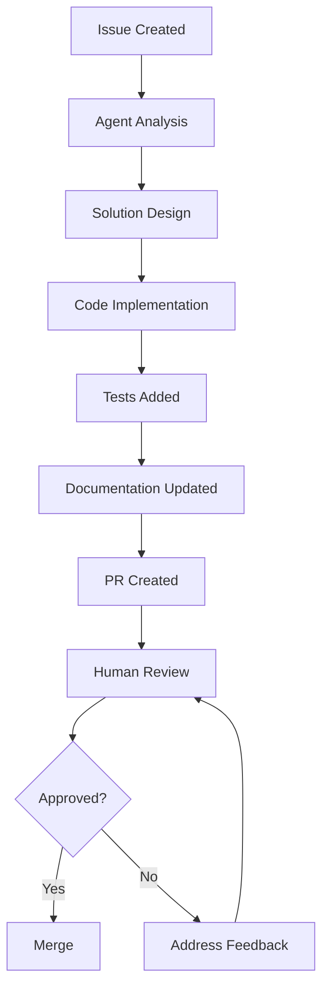

# Contributing to Oatie

Thank you for your interest in contributing to Oatie! This document provides comprehensive guidelines for contributing to the Oatie AI reporting platform.

## Table of Contents

- [Code of Conduct](#code-of-conduct)
- [Getting Started](#getting-started)
- [Development Environment Setup](#development-environment-setup)
- [Project Structure](#project-structure)
- [Coding Standards](#coding-standards)
- [Development Workflow](#development-workflow)
- [Testing Guidelines](#testing-guidelines)
- [Pull Request Process](#pull-request-process)
- [Code Review Guidelines](#code-review-guidelines)
- [GitHub Copilot Agent Coordination](#github-copilot-agent-coordination)
- [Release Process](#release-process)
- [Getting Help](#getting-help)

## Code of Conduct

This project adheres to a [Code of Conduct](CODE_OF_CONDUCT.md). By participating, you are expected to uphold this code.

## Getting Started

### Prerequisites

Before you begin, ensure you have the following installed:

- **Python 3.9+** - For backend development
- **Node.js 16+** - For frontend development
- **Git** - For version control
- **Docker** (optional) - For containerized development
- **VS Code** (recommended) - With recommended extensions

### Fork and Clone

1. Fork the repository on GitHub
2. Clone your fork locally:
   ```bash
   git clone https://github.com/YOUR_USERNAME/oatie-ai-reporting.git
   cd oatie-ai-reporting
   ```

3. Add the upstream repository:
   ```bash
   git remote add upstream https://github.com/walsh2232/oatie-ai-reporting.git
   ```

## Development Environment Setup

### Python Environment

1. Create a virtual environment:
   ```bash
   python -m venv venv
   source venv/bin/activate  # On Windows: venv\Scripts\activate
   ```

2. Install development dependencies:
   ```bash
   pip install -r requirements-dev.txt
   ```

3. Install pre-commit hooks:
   ```bash
   pre-commit install
   ```

### Node.js Environment

1. Install dependencies:
   ```bash
   npm install
   ```

2. Install global tools (if needed):
   ```bash
   npm install -g @angular/cli  # If using Angular
   npm install -g typescript   # For TypeScript development
   ```

### Environment Variables

Create a `.env` file in the project root:

```bash
# Database Configuration
DATABASE_URL=postgresql://localhost/oatie_dev
REDIS_URL=redis://localhost:6379

# Oracle BI Publisher Configuration
OBI_SERVER_URL=https://your-obi-server.com
OBI_USERNAME=your_username
OBI_PASSWORD=your_password

# API Keys
OPENAI_API_KEY=your_openai_key
AZURE_OPENAI_ENDPOINT=your_azure_endpoint

# Application Settings
DEBUG=true
LOG_LEVEL=INFO
SECRET_KEY=your_secret_key_here
```

### Docker Setup (Optional)

```bash
# Start development services
docker-compose up -d

# Run the application
docker-compose exec app python manage.py runserver
```

## Project Structure

```
oatie-ai-reporting/
├── .github/                 # GitHub templates and workflows
├── backend/                 # Python backend application
│   ├── src/                 # Source code
│   │   ├── api/            # API endpoints
│   │   ├── core/           # Core business logic
│   │   ├── models/         # Data models
│   │   └── services/       # Service layer
│   ├── tests/              # Backend tests
│   └── requirements.txt    # Python dependencies
├── frontend/               # TypeScript/Angular frontend
│   ├── src/               # Source code
│   │   ├── app/           # Angular application
│   │   ├── assets/        # Static assets
│   │   └── environments/  # Environment configurations
│   ├── tests/             # Frontend tests
│   └── package.json       # Node.js dependencies
├── docs/                  # Documentation
├── scripts/               # Development scripts
├── docker-compose.yml     # Docker configuration
└── README.md              # Project overview
```

## Coding Standards

### Python Standards

We follow [PEP 8](https://pep8.org/) and use the following tools:

#### Code Formatting
- **Black**: Code formatter with 88-character line length
- **isort**: Import sorting

#### Linting
- **Pylint**: Code analysis (minimum score: 8.0/10)
- **Flake8**: Style guide enforcement

#### Type Checking
- **MyPy**: Static type checking
- Use type hints for all function signatures
- Use dataclasses or Pydantic models for data structures

#### Code Examples

```python
from typing import List, Optional
from dataclasses import dataclass

@dataclass
class ReportConfig:
    """Configuration for report generation."""
    name: str
    template_id: str
    parameters: Optional[dict] = None

def generate_report(config: ReportConfig) -> str:
    """Generate a report based on the provided configuration.
    
    Args:
        config: Report configuration containing name, template, and parameters
        
    Returns:
        Generated report content as string
        
    Raises:
        ReportGenerationError: If report generation fails
    """
    # Implementation here
    pass
```

### TypeScript Standards

We follow [Angular Style Guide](https://angular.io/guide/styleguide) and use:

#### Code Formatting
- **Prettier**: Code formatter
- **ESLint**: Linting with Angular-specific rules

#### TypeScript Configuration
- Strict mode enabled
- No implicit any
- Strict null checks

#### Code Examples

```typescript
export interface ReportConfig {
  name: string;
  templateId: string;
  parameters?: Record<string, unknown>;
}

export class ReportService {
  constructor(private http: HttpClient) {}

  generateReport(config: ReportConfig): Observable<string> {
    return this.http.post<string>('/api/reports/generate', config);
  }
}
```

### Documentation Standards

- Use clear, concise language
- Include code examples for APIs
- Document all public interfaces
- Use JSDoc/Sphinx for API documentation
- Follow [Google Style Guide](https://google.github.io/styleguide/docguide/style.html) for documentation

## Development Workflow

### Branch Strategy

We use GitFlow with the following branches:

- `main`: Production-ready code
- `develop`: Integration branch for features
- `feature/*`: Feature development branches
- `hotfix/*`: Critical bug fixes
- `release/*`: Release preparation

### Creating a Feature Branch

```bash
# Update your local main branch
git checkout main
git pull upstream main

# Create and switch to a new feature branch
git checkout -b feature/your-feature-name

# Make your changes and commit
git add .
git commit -m "feat: add new feature description"

# Push to your fork
git push origin feature/your-feature-name
```

### Commit Message Format

We follow [Conventional Commits](https://www.conventionalcommits.org/):

```
type(scope): description

[optional body]

[optional footer]
```

Types:
- `feat`: New feature
- `fix`: Bug fix
- `docs`: Documentation changes
- `style`: Code style changes (formatting, etc.)
- `refactor`: Code refactoring
- `test`: Adding or updating tests
- `chore`: Maintenance tasks

Examples:
```
feat(api): add report generation endpoint
fix(ui): resolve navigation menu overflow issue
docs(readme): update installation instructions
```

## Testing Guidelines

### Test Coverage Requirements

- **Minimum Coverage**: 95% for new code
- **Unit Tests**: Required for all business logic
- **Integration Tests**: Required for API endpoints
- **E2E Tests**: Required for critical user workflows

### Python Testing

Use pytest for testing:

```python
import pytest
from unittest.mock import Mock, patch
from src.services.report_service import ReportService

class TestReportService:
    def setup_method(self):
        self.service = ReportService()
    
    def test_generate_report_success(self):
        # Arrange
        config = ReportConfig(name="test", template_id="123")
        
        # Act
        result = self.service.generate_report(config)
        
        # Assert
        assert result is not None
        assert "test" in result
    
    @patch('src.services.report_service.external_api_call')
    def test_generate_report_with_mock(self, mock_api):
        # Arrange
        mock_api.return_value = "mocked_response"
        
        # Act & Assert
        # Test implementation
```

### TypeScript Testing

Use Jasmine/Jest with Angular Testing Utilities:

```typescript
describe('ReportService', () => {
  let service: ReportService;
  let httpMock: HttpTestingController;

  beforeEach(() => {
    TestBed.configureTestingModule({
      imports: [HttpClientTestingModule],
      providers: [ReportService]
    });
    service = TestBed.inject(ReportService);
    httpMock = TestBed.inject(HttpTestingController);
  });

  it('should generate report', () => {
    const mockConfig: ReportConfig = { name: 'test', templateId: '123' };
    const mockResponse = 'generated report';

    service.generateReport(mockConfig).subscribe(response => {
      expect(response).toBe(mockResponse);
    });

    const req = httpMock.expectOne('/api/reports/generate');
    expect(req.request.method).toBe('POST');
    req.flush(mockResponse);
  });
});
```

### Running Tests

```bash
# Python tests
pytest --cov=src --cov-report=html

# JavaScript/TypeScript tests
npm test
npm run test:coverage

# Run all tests
npm run test:all
```

## Pull Request Process

### Before Submitting

1. **Update your branch**:
   ```bash
   git checkout main
   git pull upstream main
   git checkout feature/your-feature
   git rebase main
   ```

2. **Run quality checks**:
   ```bash
   # Python
   black .
   isort .
   pylint src/
   mypy src/
   pytest

   # TypeScript
   npm run lint
   npm run format
   npm test
   ```

3. **Update documentation** if needed

### Submitting the Pull Request

1. Push your branch to your fork
2. Create a pull request on GitHub
3. Fill out the pull request template completely
4. Link any related issues
5. Request review from appropriate team members

### Pull Request Requirements

- [ ] All tests pass
- [ ] Code coverage maintained/improved
- [ ] Documentation updated
- [ ] No merge conflicts
- [ ] Follows coding standards
- [ ] Has appropriate tests
- [ ] Commit messages follow convention
- [ ] PR template filled out completely

## Code Review Guidelines

### For Authors

- Keep PRs small and focused (< 400 lines of changes)
- Provide clear description and context
- Respond to feedback promptly
- Make requested changes in new commits (don't force push)
- Rebase and squash commits before final merge

### For Reviewers

- Review within 24 hours during business days
- Be constructive and specific in feedback
- Test the changes locally when possible
- Check for:
  - Code quality and standards adherence
  - Security implications
  - Performance impact
  - Test coverage
  - Documentation updates

### Review Checklist

- [ ] Code follows project standards
- [ ] Logic is sound and efficient
- [ ] Error handling is appropriate
- [ ] Security considerations addressed
- [ ] Tests are comprehensive
- [ ] Documentation is updated
- [ ] No sensitive data exposed
- [ ] Performance impact acceptable

## GitHub Copilot Agent Coordination

### Agent Interaction Guidelines

When working with GitHub Copilot agents:

1. **Clear Communication**:
   - Use descriptive commit messages
   - Provide context in PR descriptions
   - Tag issues and PRs appropriately

2. **Code Quality Standards**:
   - Agents must follow the same coding standards
   - All agent-generated code must pass quality checks
   - Human review required for agent contributions

3. **Testing Requirements**:
   - Agent changes must include appropriate tests
   - Coverage requirements apply to all code
   - Integration tests for significant changes

4. **Documentation**:
   - Agents should update relevant documentation
   - API changes require documentation updates
   - Include examples for new features

### Agent Workflow



## Release Process

### Version Numbering

We use [Semantic Versioning](https://semver.org/):

- **MAJOR**: Breaking changes
- **MINOR**: New features (backward compatible)
- **PATCH**: Bug fixes (backward compatible)

### Release Workflow

1. **Prepare Release Branch**:
   ```bash
   git checkout develop
   git pull origin develop
   git checkout -b release/v1.2.0
   ```

2. **Update Version Numbers**:
   - Update `package.json`
   - Update `__version__` in Python modules
   - Update `CHANGELOG.md`

3. **Final Testing**:
   - Run full test suite
   - Perform manual testing
   - Verify documentation

4. **Create Release**:
   ```bash
   git checkout main
   git merge release/v1.2.0
   git tag v1.2.0
   git push origin main --tags
   ```

5. **Deploy**:
   - Automated deployment via GitHub Actions
   - Monitor deployment health
   - Rollback if issues detected

### Hotfix Process

For critical production issues:

```bash
git checkout main
git checkout -b hotfix/critical-issue
# Make minimal fix
git checkout main
git merge hotfix/critical-issue
git tag v1.2.1
git push origin main --tags
```

## Getting Help

### Resources

- **Documentation**: [docs/](./docs/)
- **API Reference**: [docs/api/](./docs/api/)
- **Architecture**: [docs/architecture/](./docs/architecture/)
- **Troubleshooting**: [docs/troubleshooting.md](./docs/troubleshooting.md)

### Communication Channels

- **GitHub Issues**: For bugs and feature requests
- **GitHub Discussions**: For questions and ideas
- **Team Chat**: For real-time coordination
- **Email**: For security-related issues

### Common Issues

#### Development Environment

**Virtual environment not activating**:
```bash
# Windows
venv\Scripts\activate.bat

# macOS/Linux
source venv/bin/activate
```

**Port already in use**:
```bash
# Find process using port
lsof -i :8000

# Kill process
kill -9 <PID>
```

#### Testing Issues

**Tests failing locally**:
```bash
# Clear cache and reinstall
rm -rf .pytest_cache
pip install -r requirements-dev.txt
pytest --cache-clear
```

#### Git Issues

**Merge conflicts**:
```bash
git rebase upstream/main
# Resolve conflicts in files
git add .
git rebase --continue
```

### Getting Support

If you need help:

1. Check existing documentation
2. Search GitHub issues
3. Create a new issue with:
   - Clear description of the problem
   - Steps to reproduce
   - Environment details
   - Error messages

---

Thank you for contributing to Oatie! Your efforts help make Oracle BI Publisher more accessible and powerful through AI assistance.