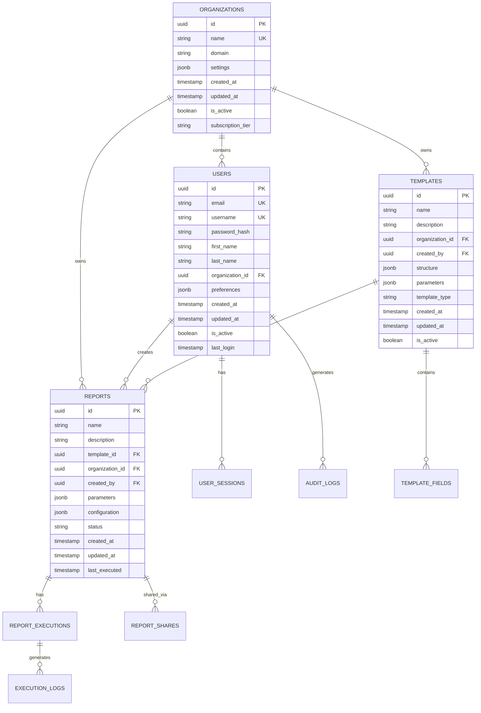

# Database Schema and Migration Procedures

## Overview

This document outlines the database schema design, migration procedures, and data management strategies for the Oatie AI reporting platform.

## Database Design Principles

### 1. Normalization
- **3NF Compliance**: Eliminate data redundancy while maintaining performance
- **Denormalization**: Strategic denormalization for read-heavy operations
- **Balance**: Trade-offs between storage efficiency and query performance

### 2. Performance
- **Indexing Strategy**: Optimized indexes for common query patterns
- **Partitioning**: Table partitioning for large datasets
- **Query Optimization**: Efficient query design and execution plans

### 3. Scalability
- **Horizontal Scaling**: Support for read replicas and sharding
- **Vertical Scaling**: Efficient resource utilization
- **Growth Planning**: Schema design for future requirements

### 4. Data Integrity
- **Constraints**: Foreign keys, check constraints, unique constraints
- **Validation**: Application and database-level validation
- **Consistency**: ACID compliance and transaction management

## Schema Overview

### Entity Relationship Diagram



## Core Tables

### 1. Users Table

```sql
CREATE TABLE users (
    id UUID PRIMARY KEY DEFAULT gen_random_uuid(),
    email VARCHAR(255) NOT NULL UNIQUE,
    username VARCHAR(100) NOT NULL UNIQUE,
    password_hash VARCHAR(255) NOT NULL,
    first_name VARCHAR(100) NOT NULL,
    last_name VARCHAR(100) NOT NULL,
    organization_id UUID NOT NULL REFERENCES organizations(id) ON DELETE CASCADE,
    role VARCHAR(50) NOT NULL DEFAULT 'user',
    preferences JSONB DEFAULT '{}',
    created_at TIMESTAMP WITH TIME ZONE DEFAULT NOW(),
    updated_at TIMESTAMP WITH TIME ZONE DEFAULT NOW(),
    is_active BOOLEAN DEFAULT true,
    last_login TIMESTAMP WITH TIME ZONE,
    email_verified BOOLEAN DEFAULT false,
    phone VARCHAR(20),
    timezone VARCHAR(50) DEFAULT 'UTC',
    language VARCHAR(10) DEFAULT 'en',
    
    CONSTRAINT valid_role CHECK (role IN ('super_admin', 'org_admin', 'report_manager', 'report_viewer', 'user')),
    CONSTRAINT valid_email CHECK (email ~* '^[A-Za-z0-9._%+-]+@[A-Za-z0-9.-]+\.[A-Za-z]{2,}$'),
    CONSTRAINT valid_username CHECK (username ~* '^[a-zA-Z0-9_-]{3,30}$')
);

-- Indexes for users table
CREATE INDEX idx_users_organization_id ON users(organization_id);
CREATE INDEX idx_users_email ON users(email);
CREATE INDEX idx_users_username ON users(username);
CREATE INDEX idx_users_role ON users(role);
CREATE INDEX idx_users_is_active ON users(is_active);
CREATE INDEX idx_users_last_login ON users(last_login DESC);

-- Trigger for updated_at
CREATE OR REPLACE FUNCTION update_updated_at_column()
RETURNS TRIGGER AS $$
BEGIN
    NEW.updated_at = NOW();
    RETURN NEW;
END;
$$ language 'plpgsql';

CREATE TRIGGER update_users_updated_at BEFORE UPDATE
    ON users FOR EACH ROW EXECUTE FUNCTION update_updated_at_column();
```

### 2. Organizations Table

```sql
CREATE TABLE organizations (
    id UUID PRIMARY KEY DEFAULT gen_random_uuid(),
    name VARCHAR(255) NOT NULL UNIQUE,
    domain VARCHAR(255),
    slug VARCHAR(100) NOT NULL UNIQUE,
    description TEXT,
    settings JSONB DEFAULT '{}',
    created_at TIMESTAMP WITH TIME ZONE DEFAULT NOW(),
    updated_at TIMESTAMP WITH TIME ZONE DEFAULT NOW(),
    is_active BOOLEAN DEFAULT true,
    subscription_tier VARCHAR(50) DEFAULT 'free',
    subscription_expires_at TIMESTAMP WITH TIME ZONE,
    max_users INTEGER DEFAULT 10,
    max_reports INTEGER DEFAULT 100,
    storage_limit_gb INTEGER DEFAULT 5,
    
    CONSTRAINT valid_subscription_tier CHECK (subscription_tier IN ('free', 'pro', 'enterprise')),
    CONSTRAINT valid_slug CHECK (slug ~* '^[a-z0-9-]{3,50}$'),
    CONSTRAINT valid_domain CHECK (domain ~* '^[a-zA-Z0-9.-]+\.[a-zA-Z]{2,}$' OR domain IS NULL)
);

-- Indexes for organizations table
CREATE INDEX idx_organizations_domain ON organizations(domain);
CREATE INDEX idx_organizations_slug ON organizations(slug);
CREATE INDEX idx_organizations_is_active ON organizations(is_active);
CREATE INDEX idx_organizations_subscription_tier ON organizations(subscription_tier);

CREATE TRIGGER update_organizations_updated_at BEFORE UPDATE
    ON organizations FOR EACH ROW EXECUTE FUNCTION update_updated_at_column();
```

### 3. Templates Table

```sql
CREATE TABLE templates (
    id UUID PRIMARY KEY DEFAULT gen_random_uuid(),
    name VARCHAR(255) NOT NULL,
    description TEXT,
    organization_id UUID NOT NULL REFERENCES organizations(id) ON DELETE CASCADE,
    created_by UUID NOT NULL REFERENCES users(id) ON DELETE RESTRICT,
    template_type VARCHAR(50) NOT NULL,
    structure JSONB NOT NULL DEFAULT '{}',
    parameters JSONB DEFAULT '{}',
    configuration JSONB DEFAULT '{}',
    version INTEGER DEFAULT 1,
    is_active BOOLEAN DEFAULT true,
    is_public BOOLEAN DEFAULT false,
    created_at TIMESTAMP WITH TIME ZONE DEFAULT NOW(),
    updated_at TIMESTAMP WITH TIME ZONE DEFAULT NOW(),
    
    CONSTRAINT valid_template_type CHECK (template_type IN ('tabular', 'chart', 'dashboard', 'custom')),
    CONSTRAINT valid_version CHECK (version > 0),
    UNIQUE(organization_id, name, version)
);

-- Indexes for templates table
CREATE INDEX idx_templates_organization_id ON templates(organization_id);
CREATE INDEX idx_templates_created_by ON templates(created_by);
CREATE INDEX idx_templates_template_type ON templates(template_type);
CREATE INDEX idx_templates_is_active ON templates(is_active);
CREATE INDEX idx_templates_is_public ON templates(is_public);
CREATE INDEX idx_templates_created_at ON templates(created_at DESC);

CREATE TRIGGER update_templates_updated_at BEFORE UPDATE
    ON templates FOR EACH ROW EXECUTE FUNCTION update_updated_at_column();
```

### 4. Reports Table

```sql
CREATE TABLE reports (
    id UUID PRIMARY KEY DEFAULT gen_random_uuid(),
    name VARCHAR(255) NOT NULL,
    description TEXT,
    template_id UUID NOT NULL REFERENCES templates(id) ON DELETE RESTRICT,
    organization_id UUID NOT NULL REFERENCES organizations(id) ON DELETE CASCADE,
    created_by UUID NOT NULL REFERENCES users(id) ON DELETE RESTRICT,
    parameters JSONB DEFAULT '{}',
    configuration JSONB DEFAULT '{}',
    status VARCHAR(50) DEFAULT 'draft',
    priority INTEGER DEFAULT 5,
    scheduled_at TIMESTAMP WITH TIME ZONE,
    created_at TIMESTAMP WITH TIME ZONE DEFAULT NOW(),
    updated_at TIMESTAMP WITH TIME ZONE DEFAULT NOW(),
    last_executed TIMESTAMP WITH TIME ZONE,
    execution_count INTEGER DEFAULT 0,
    
    CONSTRAINT valid_status CHECK (status IN ('draft', 'scheduled', 'processing', 'completed', 'failed', 'cancelled')),
    CONSTRAINT valid_priority CHECK (priority BETWEEN 1 AND 10)
);

-- Indexes for reports table
CREATE INDEX idx_reports_organization_id ON reports(organization_id);
CREATE INDEX idx_reports_template_id ON reports(template_id);
CREATE INDEX idx_reports_created_by ON reports(created_by);
CREATE INDEX idx_reports_status ON reports(status);
CREATE INDEX idx_reports_scheduled_at ON reports(scheduled_at) WHERE scheduled_at IS NOT NULL;
CREATE INDEX idx_reports_created_at ON reports(created_at DESC);
CREATE INDEX idx_reports_last_executed ON reports(last_executed DESC);

CREATE TRIGGER update_reports_updated_at BEFORE UPDATE
    ON reports FOR EACH ROW EXECUTE FUNCTION update_updated_at_column();
```

### 5. Report Executions Table

```sql
CREATE TABLE report_executions (
    id UUID PRIMARY KEY DEFAULT gen_random_uuid(),
    report_id UUID NOT NULL REFERENCES reports(id) ON DELETE CASCADE,
    executed_by UUID NOT NULL REFERENCES users(id) ON DELETE RESTRICT,
    status VARCHAR(50) DEFAULT 'running',
    started_at TIMESTAMP WITH TIME ZONE DEFAULT NOW(),
    completed_at TIMESTAMP WITH TIME ZONE,
    execution_time_ms INTEGER,
    result_size_bytes BIGINT,
    output_format VARCHAR(20),
    output_url TEXT,
    error_message TEXT,
    metadata JSONB DEFAULT '{}',
    
    CONSTRAINT valid_execution_status CHECK (status IN ('running', 'completed', 'failed', 'cancelled')),
    CONSTRAINT valid_output_format CHECK (output_format IN ('pdf', 'excel', 'csv', 'json', 'html')),
    CONSTRAINT valid_execution_time CHECK (execution_time_ms >= 0),
    CONSTRAINT completed_at_after_started CHECK (completed_at IS NULL OR completed_at >= started_at)
);

-- Partitioning by month for large datasets
CREATE TABLE report_executions_y2024m01 PARTITION OF report_executions
    FOR VALUES FROM ('2024-01-01') TO ('2024-02-01');

-- Indexes for report_executions table
CREATE INDEX idx_report_executions_report_id ON report_executions(report_id);
CREATE INDEX idx_report_executions_executed_by ON report_executions(executed_by);
CREATE INDEX idx_report_executions_status ON report_executions(status);
CREATE INDEX idx_report_executions_started_at ON report_executions(started_at DESC);
CREATE INDEX idx_report_executions_completed_at ON report_executions(completed_at DESC);
```

### 6. Audit Logs Table

```sql
CREATE TABLE audit_logs (
    id UUID PRIMARY KEY DEFAULT gen_random_uuid(),
    user_id UUID REFERENCES users(id) ON DELETE SET NULL,
    organization_id UUID NOT NULL REFERENCES organizations(id) ON DELETE CASCADE,
    action VARCHAR(100) NOT NULL,
    resource_type VARCHAR(50) NOT NULL,
    resource_id UUID,
    old_values JSONB,
    new_values JSONB,
    ip_address INET,
    user_agent TEXT,
    timestamp TIMESTAMP WITH TIME ZONE DEFAULT NOW(),
    session_id UUID,
    
    CONSTRAINT valid_action CHECK (action IN ('create', 'read', 'update', 'delete', 'login', 'logout', 'export')),
    CONSTRAINT valid_resource_type CHECK (resource_type IN ('user', 'organization', 'template', 'report', 'execution'))
);

-- Partitioning by month for audit logs
CREATE TABLE audit_logs_y2024m01 PARTITION OF audit_logs
    FOR VALUES FROM ('2024-01-01') TO ('2024-02-01');

-- Indexes for audit_logs table
CREATE INDEX idx_audit_logs_user_id ON audit_logs(user_id);
CREATE INDEX idx_audit_logs_organization_id ON audit_logs(organization_id);
CREATE INDEX idx_audit_logs_action ON audit_logs(action);
CREATE INDEX idx_audit_logs_resource_type ON audit_logs(resource_type);
CREATE INDEX idx_audit_logs_resource_id ON audit_logs(resource_id);
CREATE INDEX idx_audit_logs_timestamp ON audit_logs(timestamp DESC);
```

## Migration Procedures

### 1. Migration Framework

#### Migration File Structure
```
migrations/
├── 001_initial_schema.sql
├── 002_add_user_preferences.sql
├── 003_create_audit_logs.sql
├── 004_add_template_versioning.sql
└── rollback/
    ├── 001_rollback_initial_schema.sql
    ├── 002_rollback_user_preferences.sql
    └── ...
```

#### Migration Metadata Table
```sql
CREATE TABLE schema_migrations (
    version VARCHAR(255) PRIMARY KEY,
    applied_at TIMESTAMP WITH TIME ZONE DEFAULT NOW(),
    rollback_sql TEXT,
    checksum VARCHAR(64),
    applied_by VARCHAR(255) DEFAULT current_user
);
```

### 2. Migration Scripts

#### Forward Migration Template
```sql
-- Migration: 004_add_template_versioning.sql
-- Description: Add versioning support to templates table
-- Author: Development Team
-- Date: 2024-01-15

BEGIN;

-- Add version column to templates
ALTER TABLE templates 
ADD COLUMN version INTEGER DEFAULT 1,
ADD COLUMN parent_template_id UUID REFERENCES templates(id);

-- Create unique constraint for name+version combination
ALTER TABLE templates 
ADD CONSTRAINT unique_template_name_version 
UNIQUE(organization_id, name, version);

-- Create index for version queries
CREATE INDEX idx_templates_version ON templates(version);
CREATE INDEX idx_templates_parent_template_id ON templates(parent_template_id);

-- Update existing templates to version 1
UPDATE templates SET version = 1 WHERE version IS NULL;

-- Make version NOT NULL
ALTER TABLE templates ALTER COLUMN version SET NOT NULL;

-- Insert migration record
INSERT INTO schema_migrations (version, rollback_sql) VALUES (
    '004_add_template_versioning',
    'ALTER TABLE templates DROP COLUMN version, DROP COLUMN parent_template_id;'
);

COMMIT;
```

#### Rollback Migration Template
```sql
-- Rollback: 004_rollback_template_versioning.sql
-- Description: Rollback template versioning changes
-- Author: Development Team
-- Date: 2024-01-15

BEGIN;

-- Remove constraints and indexes
DROP INDEX IF EXISTS idx_templates_version;
DROP INDEX IF EXISTS idx_templates_parent_template_id;
ALTER TABLE templates DROP CONSTRAINT IF EXISTS unique_template_name_version;

-- Remove columns
ALTER TABLE templates 
DROP COLUMN IF EXISTS version,
DROP COLUMN IF EXISTS parent_template_id;

-- Remove migration record
DELETE FROM schema_migrations WHERE version = '004_add_template_versioning';

COMMIT;
```

### 3. Migration Execution

#### Migration Runner Script
```python
#!/usr/bin/env python3
"""
Database migration runner for Oatie platform
"""

import os
import hashlib
import psycopg2
from pathlib import Path

class MigrationRunner:
    def __init__(self, database_url: str, migrations_dir: str):
        self.database_url = database_url
        self.migrations_dir = Path(migrations_dir)
        self.conn = psycopg2.connect(database_url)
    
    def get_applied_migrations(self) -> set:
        """Get list of applied migrations"""
        with self.conn.cursor() as cur:
            cur.execute("SELECT version FROM schema_migrations")
            return {row[0] for row in cur.fetchall()}
    
    def get_pending_migrations(self) -> list:
        """Get list of pending migrations"""
        applied = self.get_applied_migrations()
        all_migrations = sorted([
            f.stem for f in self.migrations_dir.glob("*.sql")
            if not f.stem.startswith("rollback_")
        ])
        return [m for m in all_migrations if m not in applied]
    
    def apply_migration(self, migration_name: str):
        """Apply a single migration"""
        migration_file = self.migrations_dir / f"{migration_name}.sql"
        
        with open(migration_file, 'r') as f:
            sql_content = f.read()
        
        # Calculate checksum
        checksum = hashlib.sha256(sql_content.encode()).hexdigest()
        
        # Execute migration
        with self.conn.cursor() as cur:
            cur.execute(sql_content)
            self.conn.commit()
        
        print(f"Applied migration: {migration_name}")
    
    def rollback_migration(self, migration_name: str):
        """Rollback a single migration"""
        with self.conn.cursor() as cur:
            cur.execute(
                "SELECT rollback_sql FROM schema_migrations WHERE version = %s",
                (migration_name,)
            )
            result = cur.fetchone()
            
            if not result:
                raise ValueError(f"Migration {migration_name} not found")
            
            rollback_sql = result[0]
            if rollback_sql:
                cur.execute(rollback_sql)
                self.conn.commit()
                print(f"Rolled back migration: {migration_name}")
    
    def migrate(self):
        """Apply all pending migrations"""
        pending = self.get_pending_migrations()
        
        if not pending:
            print("No pending migrations")
            return
        
        print(f"Applying {len(pending)} migrations...")
        
        for migration in pending:
            self.apply_migration(migration)
        
        print("All migrations applied successfully")

if __name__ == "__main__":
    import sys
    
    if len(sys.argv) < 2:
        print("Usage: migrate.py <command> [migration_name]")
        print("Commands: migrate, rollback, status")
        sys.exit(1)
    
    database_url = os.environ["DATABASE_URL"]
    runner = MigrationRunner(database_url, "./migrations")
    
    command = sys.argv[1]
    
    if command == "migrate":
        runner.migrate()
    elif command == "rollback" and len(sys.argv) > 2:
        runner.rollback_migration(sys.argv[2])
    elif command == "status":
        applied = runner.get_applied_migrations()
        pending = runner.get_pending_migrations()
        print(f"Applied migrations: {len(applied)}")
        print(f"Pending migrations: {len(pending)}")
        if pending:
            print("Pending:")
            for m in pending:
                print(f"  - {m}")
    else:
        print("Invalid command")
        sys.exit(1)
```

### 4. Data Migration Procedures

#### Large Table Migrations
```sql
-- For large table modifications, use batched updates
DO $$
DECLARE
    batch_size INTEGER := 1000;
    total_rows INTEGER;
    processed_rows INTEGER := 0;
BEGIN
    -- Get total count
    SELECT COUNT(*) INTO total_rows FROM reports WHERE status IS NULL;
    
    RAISE NOTICE 'Processing % rows in batches of %', total_rows, batch_size;
    
    -- Process in batches
    WHILE processed_rows < total_rows LOOP
        UPDATE reports 
        SET status = 'draft' 
        WHERE id IN (
            SELECT id FROM reports 
            WHERE status IS NULL 
            LIMIT batch_size
        );
        
        processed_rows := processed_rows + batch_size;
        
        RAISE NOTICE 'Processed % of % rows', processed_rows, total_rows;
        
        -- Commit batch and brief pause
        COMMIT;
        PERFORM pg_sleep(0.1);
    END LOOP;
    
    RAISE NOTICE 'Migration completed successfully';
END $$;
```

### 5. Backup and Recovery

#### Pre-migration Backup
```bash
#!/bin/bash
# Pre-migration backup script

BACKUP_DIR="/backups/$(date +%Y%m%d_%H%M%S)"
mkdir -p "$BACKUP_DIR"

# Full database backup
pg_dump "$DATABASE_URL" > "$BACKUP_DIR/full_backup.sql"

# Schema-only backup
pg_dump --schema-only "$DATABASE_URL" > "$BACKUP_DIR/schema_backup.sql"

# Data-only backup for critical tables
pg_dump --data-only --table=users --table=organizations \
    "$DATABASE_URL" > "$BACKUP_DIR/critical_data_backup.sql"

echo "Backup completed: $BACKUP_DIR"
```

#### Point-in-time Recovery
```bash
#!/bin/bash
# Point-in-time recovery script

RECOVERY_TIME="2024-01-15 14:30:00"
BACKUP_FILE="$1"

# Stop application services
systemctl stop oatie-api

# Restore from backup
psql "$DATABASE_URL" < "$BACKUP_FILE"

# Apply WAL files up to recovery time
pg_waldump --start="$RECOVERY_TIME" /var/lib/postgresql/wal/

# Start application services
systemctl start oatie-api
```

## Performance Optimization

### 1. Index Strategy

#### Query-specific Indexes
```sql
-- Composite index for common report queries
CREATE INDEX idx_reports_org_status_created 
ON reports(organization_id, status, created_at DESC);

-- Partial index for active templates only
CREATE INDEX idx_templates_active_org 
ON templates(organization_id, name) 
WHERE is_active = true;

-- Expression index for case-insensitive searches
CREATE INDEX idx_users_email_lower 
ON users(LOWER(email));

-- JSONB indexes for parameter searches
CREATE INDEX idx_reports_parameters_gin 
ON reports USING GIN(parameters);
```

#### Index Monitoring
```sql
-- Monitor index usage
SELECT 
    schemaname,
    tablename,
    indexname,
    idx_tup_read,
    idx_tup_fetch,
    idx_scan,
    idx_tup_read::float / NULLIF(idx_scan, 0) as avg_tuples_per_scan
FROM pg_stat_user_indexes
ORDER BY idx_scan DESC;

-- Find unused indexes
SELECT 
    schemaname,
    tablename,
    indexname,
    idx_scan,
    pg_size_pretty(pg_relation_size(indexrelid)) as size
FROM pg_stat_user_indexes
WHERE idx_scan < 10
ORDER BY pg_relation_size(indexrelid) DESC;
```

### 2. Query Optimization

#### Optimized Queries
```sql
-- Efficient pagination with cursor-based approach
SELECT id, name, created_at
FROM reports
WHERE organization_id = $1
  AND created_at < $2  -- cursor value
ORDER BY created_at DESC
LIMIT 20;

-- Optimized aggregation with covering index
SELECT 
    status,
    COUNT(*) as count,
    AVG(execution_time_ms) as avg_execution_time
FROM report_executions
WHERE started_at >= NOW() - INTERVAL '30 days'
GROUP BY status;

-- Efficient exists check instead of COUNT
SELECT EXISTS(
    SELECT 1 FROM reports 
    WHERE template_id = $1 AND status = 'processing'
) as has_processing_reports;
```

This comprehensive database schema and migration strategy provides a solid foundation for the Oatie platform while ensuring scalability, performance, and maintainability.