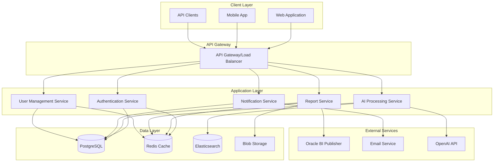
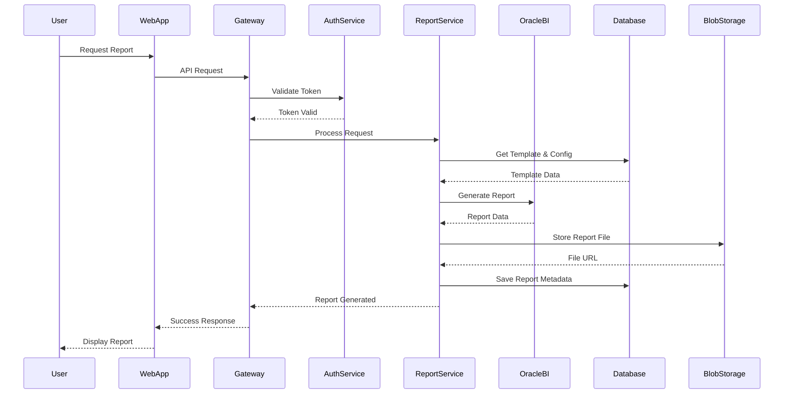
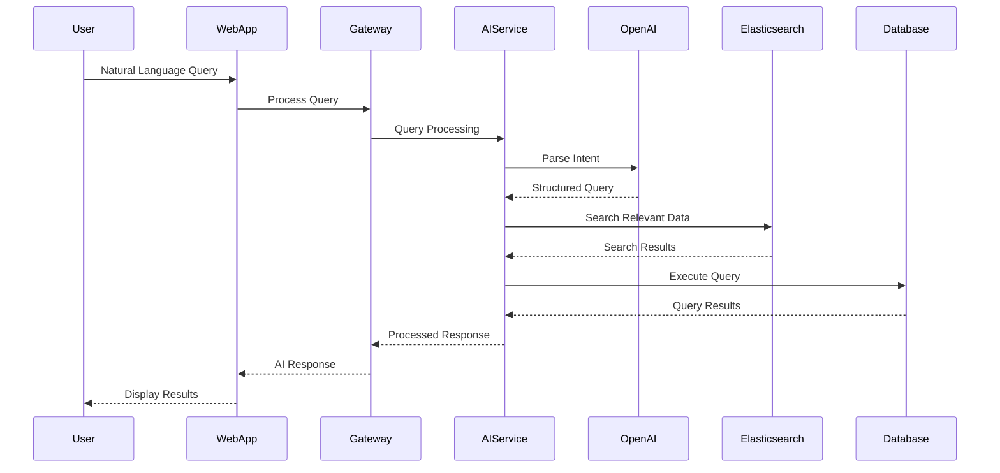
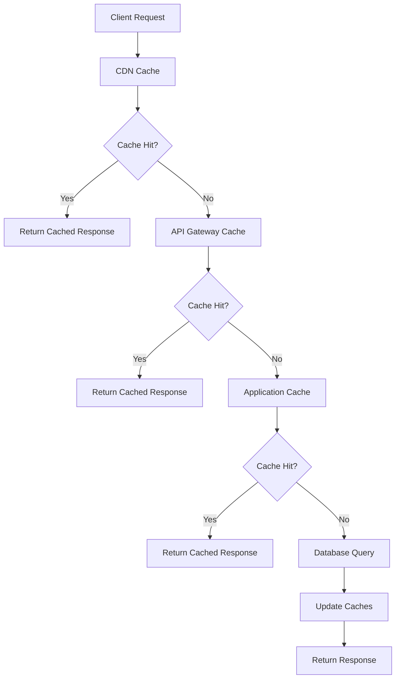
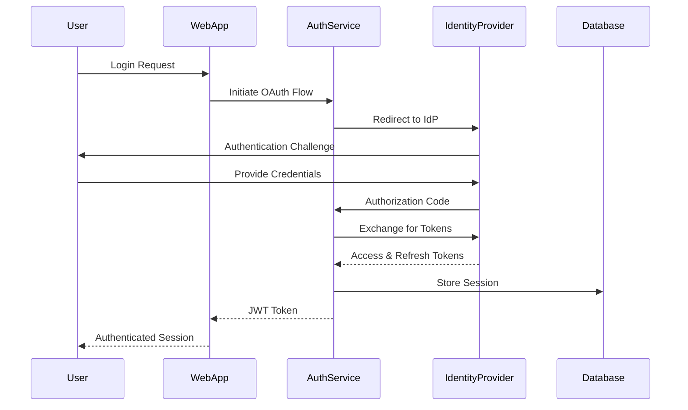

# System Architecture Overview

## Introduction

This document provides a high-level overview of the Oatie AI reporting platform architecture, including system components, data flow, and key design decisions.

## Architecture Principles

### 1. Scalability
- Microservices architecture for independent scaling
- Horizontal scaling capabilities
- Auto-scaling based on demand
- Load balancing across services

### 2. Reliability
- High availability with 99.9% uptime target
- Fault tolerance and graceful degradation
- Circuit breaker patterns
- Comprehensive monitoring and alerting

### 3. Security
- Zero-trust security model
- End-to-end encryption
- OAuth2/OIDC authentication
- Role-based access control (RBAC)

### 4. Performance
- Sub-second response times for core operations
- Optimized database queries
- Caching strategies
- CDN for static assets

### 5. Maintainability
- Clean code architecture
- Comprehensive documentation
- Automated testing
- Continuous integration/deployment

## System Overview



## Core Components

### 1. Frontend Layer

#### Web Application
- **Technology**: Angular 17+ with TypeScript
- **Design System**: Oracle Redwood Design System
- **Features**:
  - Responsive design for desktop and mobile
  - Real-time updates via WebSocket
  - Progressive Web App (PWA) capabilities
  - Accessibility compliance (WCAG 2.1 AA)

#### Mobile Application
- **Technology**: Ionic with Angular
- **Platforms**: iOS and Android
- **Features**:
  - Native mobile experience
  - Offline report viewing
  - Push notifications
  - Biometric authentication

### 2. API Gateway

#### Load Balancer/API Gateway
- **Technology**: NGINX + Kong/API Gateway
- **Responsibilities**:
  - Request routing and load balancing
  - Rate limiting and throttling
  - SSL termination
  - API versioning
  - Request/response transformation
  - Metrics collection

#### Security Layer
- **Authentication**: OAuth2/OIDC with PKCE
- **Authorization**: JWT tokens with RBAC
- **API Security**: Rate limiting, CORS, CSRF protection
- **Monitoring**: Request logging and anomaly detection

### 3. Microservices

#### Authentication Service
- **Technology**: Node.js with Express
- **Database**: PostgreSQL + Redis
- **Responsibilities**:
  - User authentication and authorization
  - JWT token management
  - Session management
  - Multi-factor authentication
  - Single sign-on (SSO) integration

#### Report Service
- **Technology**: Python with FastAPI
- **Database**: PostgreSQL
- **Responsibilities**:
  - Report generation and management
  - Template management
  - Data source integration
  - Report scheduling
  - Export functionality

#### AI Processing Service
- **Technology**: Python with FastAPI
- **AI/ML**: OpenAI API, Custom models
- **Responsibilities**:
  - Natural language query processing
  - Automated report insights
  - Data analysis and recommendations
  - Query optimization suggestions

#### Notification Service
- **Technology**: Node.js with Express
- **Queue**: Redis/Bull
- **Responsibilities**:
  - Email notifications
  - Push notifications
  - SMS notifications
  - Notification preferences
  - Delivery tracking

#### User Management Service
- **Technology**: Node.js with Express
- **Database**: PostgreSQL
- **Responsibilities**:
  - User profile management
  - Organization management
  - Permission management
  - Audit logging

### 4. Data Layer

#### PostgreSQL Database
- **Purpose**: Primary data store
- **Schema**:
  - Users and organizations
  - Reports and templates
  - Audit logs
  - Configuration data
- **Features**:
  - ACID compliance
  - Row-level security
  - Backup and point-in-time recovery
  - Read replicas for scaling

#### Redis Cache
- **Purpose**: Caching and session storage
- **Use Cases**:
  - Session management
  - Query result caching
  - Rate limiting counters
  - Real-time data
- **Configuration**:
  - Cluster mode for high availability
  - Persistence for durability
  - Pub/sub for real-time features

#### Elasticsearch
- **Purpose**: Search and analytics
- **Use Cases**:
  - Full-text search across reports
  - Log aggregation and analysis
  - Real-time analytics
  - AI query optimization
- **Configuration**:
  - Multi-node cluster
  - Index lifecycle management
  - Security and access control

#### Blob Storage
- **Purpose**: File and asset storage
- **Technology**: AWS S3 / Azure Blob Storage
- **Content**:
  - Generated reports (PDF, Excel)
  - Report templates
  - User uploads
  - Static assets
- **Features**:
  - Versioning and lifecycle policies
  - CDN integration
  - Encryption at rest

## Data Flow Architecture

### 1. Report Generation Flow



### 2. AI Query Processing Flow



## Deployment Architecture

### 1. Container Architecture

```dockerfile
# Example Dockerfile for Report Service
FROM python:3.11-slim

WORKDIR /app

COPY requirements.txt .
RUN pip install --no-cache-dir -r requirements.txt

COPY . .

EXPOSE 8000

CMD ["uvicorn", "main:app", "--host", "0.0.0.0", "--port", "8000"]
```

### 2. Kubernetes Deployment

```yaml
apiVersion: apps/v1
kind: Deployment
metadata:
  name: report-service
spec:
  replicas: 3
  selector:
    matchLabels:
      app: report-service
  template:
    metadata:
      labels:
        app: report-service
    spec:
      containers:
      - name: report-service
        image: oatie/report-service:latest
        ports:
        - containerPort: 8000
        env:
        - name: DATABASE_URL
          valueFrom:
            secretKeyRef:
              name: db-secret
              key: url
        resources:
          requests:
            memory: "256Mi"
            cpu: "250m"
          limits:
            memory: "512Mi"
            cpu: "500m"
```

### 3. Infrastructure Components

#### Load Balancing
- **Layer 7 Load Balancer**: Application-aware routing
- **Health Checks**: Automatic failover for unhealthy instances
- **SSL Termination**: Centralized certificate management
- **Geographic Distribution**: Multi-region deployment

#### Monitoring and Observability
- **Metrics**: Prometheus + Grafana
- **Logging**: ELK Stack (Elasticsearch, Logstash, Kibana)
- **Tracing**: Jaeger for distributed tracing
- **Alerting**: PagerDuty integration for critical issues

#### Security
- **Network Security**: VPC with private subnets
- **Secrets Management**: HashiCorp Vault or cloud-native solutions
- **Vulnerability Scanning**: Regular container and dependency scans
- **Compliance**: SOC 2, GDPR compliance measures

## Performance Considerations

### 1. Caching Strategy

#### Multi-Level Caching


#### Cache Invalidation
- **Time-based**: TTL for different data types
- **Event-based**: Invalidate on data changes
- **Manual**: Admin controls for cache clearing
- **Intelligent**: ML-based cache optimization

### 2. Database Optimization

#### Query Optimization
- **Indexing Strategy**: Optimized indexes for common queries
- **Query Analysis**: Regular query performance reviews
- **Connection Pooling**: Efficient database connection management
- **Read Replicas**: Separate read and write operations

#### Schema Design
```sql
-- Example optimized table structure
CREATE TABLE reports (
    id UUID PRIMARY KEY DEFAULT gen_random_uuid(),
    name VARCHAR(255) NOT NULL,
    template_id UUID REFERENCES templates(id),
    created_by UUID REFERENCES users(id),
    created_at TIMESTAMP WITH TIME ZONE DEFAULT NOW(),
    updated_at TIMESTAMP WITH TIME ZONE DEFAULT NOW(),
    status VARCHAR(50) DEFAULT 'draft',
    data JSONB,
    CONSTRAINT valid_status CHECK (status IN ('draft', 'processing', 'completed', 'failed'))
);

-- Optimized indexes
CREATE INDEX idx_reports_created_by ON reports(created_by);
CREATE INDEX idx_reports_status ON reports(status);
CREATE INDEX idx_reports_created_at ON reports(created_at DESC);
CREATE INDEX idx_reports_template_id ON reports(template_id);
```

## Security Architecture

### 1. Authentication Flow



### 2. Authorization Model

#### Role-Based Access Control (RBAC)
```yaml
Roles:
  - SuperAdmin:
      permissions: ["*"]
  
  - OrgAdmin:
      permissions: 
        - "org:manage"
        - "users:manage"
        - "reports:manage"
  
  - ReportManager:
      permissions:
        - "reports:create"
        - "reports:edit"
        - "reports:delete"
        - "templates:manage"
  
  - ReportViewer:
      permissions:
        - "reports:view"
        - "reports:export"
  
  - User:
      permissions:
        - "profile:manage"
        - "reports:view:own"
```

### 3. Data Protection

#### Encryption
- **In Transit**: TLS 1.3 for all communications
- **At Rest**: AES-256 encryption for sensitive data
- **Application Level**: Field-level encryption for PII
- **Key Management**: Dedicated key management service

#### Privacy Controls
- **Data Minimization**: Collect only necessary data
- **Consent Management**: User consent tracking
- **Right to Erasure**: Data deletion capabilities
- **Audit Trail**: Complete audit log of data access

## Scalability and Performance

### 1. Horizontal Scaling

#### Auto-scaling Configuration
```yaml
apiVersion: autoscaling/v2
kind: HorizontalPodAutoscaler
metadata:
  name: report-service-hpa
spec:
  scaleTargetRef:
    apiVersion: apps/v1
    kind: Deployment
    name: report-service
  minReplicas: 2
  maxReplicas: 20
  metrics:
  - type: Resource
    resource:
      name: cpu
      target:
        type: Utilization
        averageUtilization: 70
  - type: Resource
    resource:
      name: memory
      target:
        type: Utilization
        averageUtilization: 80
```

#### Load Testing Results
```yaml
Performance Benchmarks:
  Concurrent Users: 1000
  Response Time P95: <2s
  Throughput: 500 RPS
  Error Rate: <0.1%
  
  Database Performance:
    Query Response P95: <100ms
    Connection Pool Utilization: <80%
    Index Hit Ratio: >99%
  
  Cache Performance:
    Redis Hit Rate: >95%
    Cache Response Time: <10ms
    Memory Utilization: <70%
```

### 2. Performance Monitoring

#### Key Metrics
- **Application Metrics**: Response time, throughput, error rate
- **Infrastructure Metrics**: CPU, memory, disk, network usage
- **Business Metrics**: User engagement, feature adoption
- **Custom Metrics**: Report generation time, AI processing time

This architecture provides a solid foundation for the Oatie platform, supporting current requirements while enabling future growth and feature development.