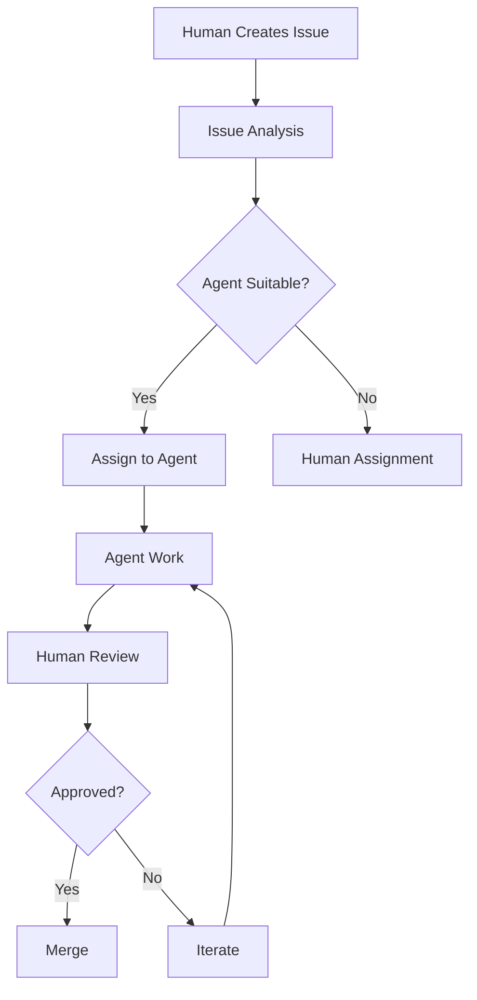
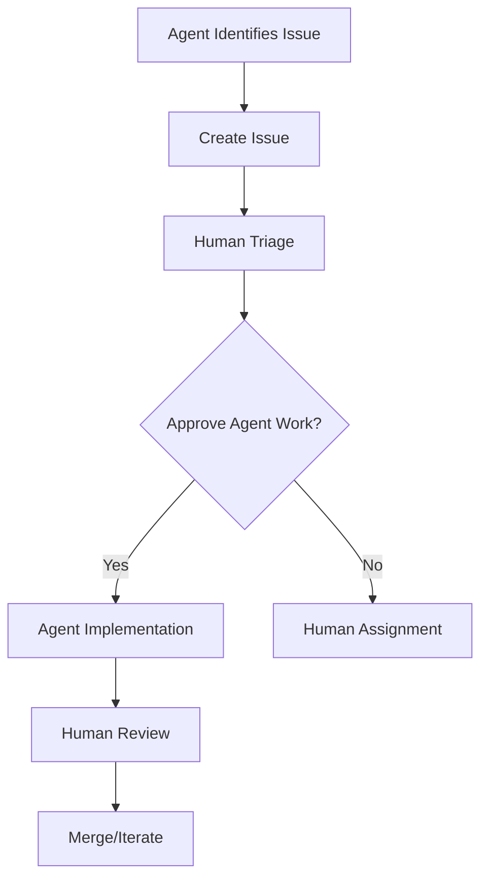

# GitHub Copilot Agent Coordination Protocols

## Overview

This document establishes protocols and guidelines for coordinating work between human developers and GitHub Copilot agents within the Oatie project ecosystem.

## Agent Coordination Principles

### 1. Clear Communication
- All agent interactions must be traceable and auditable
- Agents should provide clear rationale for their suggestions and changes
- Human oversight is required for all agent-generated code

### 2. Quality Standards
- Agents must adhere to the same code quality standards as human developers
- All agent contributions must pass automated quality checks
- Agent-generated code requires human review before merging

### 3. Transparency
- Mark agent-generated contributions clearly in commit messages and PRs
- Document agent reasoning and decision-making process
- Maintain visibility into agent activities and contributions

## Agent Classification

### Agent Types

#### 1. Code Generation Agents
- **Purpose**: Generate new code based on specifications
- **Scope**: Feature implementation, boilerplate generation, test creation
- **Oversight**: High - requires detailed review

#### 2. Code Review Agents
- **Purpose**: Analyze code for quality, security, and best practices
- **Scope**: Automated code review, suggestion generation
- **Oversight**: Medium - suggestions reviewed by humans

#### 3. Documentation Agents
- **Purpose**: Generate and maintain documentation
- **Scope**: API docs, README updates, code comments
- **Oversight**: Medium - content accuracy verification required

#### 4. Testing Agents
- **Purpose**: Generate and maintain test suites
- **Scope**: Unit tests, integration tests, test data generation
- **Oversight**: High - test logic must be verified

#### 5. Maintenance Agents
- **Purpose**: Perform routine maintenance tasks
- **Scope**: Dependency updates, code formatting, refactoring
- **Oversight**: Low - routine tasks with automated verification

## Workflow Protocols

### 1. Agent Task Assignment

#### Human-Initiated Tasks


#### Agent-Initiated Tasks


### 2. Agent Work Submission

#### Required Information
- **Agent Identity**: Which agent performed the work
- **Task Description**: What the agent was asked to do
- **Reasoning**: Why the agent chose this approach
- **Validation**: How the agent verified the solution
- **Testing**: What testing was performed

#### Commit Message Format
```
feat(agent): implement user authentication

Agent: GitHub Copilot Code Generation v1.0
Task: Implement OAuth2 authentication flow
Reasoning: Used industry-standard OAuth2 pattern for security
Validation: Tested against OAuth2 compliance checklist
Testing: Added unit tests for auth flow and edge cases

Co-authored-by: GitHub Copilot <copilot@github.com>
```

### 3. Human Review Requirements

#### Mandatory Review Areas
- **Security Implications**: All security-related changes
- **Architecture Decisions**: Design pattern choices
- **Business Logic**: Core functionality implementation
- **Data Handling**: Database operations and data transformations
- **External Integrations**: API calls and third-party services

#### Review Checklist for Agent Work
```markdown
## Agent Work Review

### Agent Information
- [ ] Agent type and version identified
- [ ] Task scope clearly defined
- [ ] Reasoning provided and sound

### Code Quality
- [ ] Follows project coding standards
- [ ] No obvious bugs or issues
- [ ] Appropriate error handling
- [ ] Code is readable and maintainable

### Testing
- [ ] Adequate test coverage
- [ ] Tests are meaningful and correct
- [ ] Edge cases considered
- [ ] Integration tests included

### Security
- [ ] No security vulnerabilities introduced
- [ ] Proper input validation
- [ ] Authentication/authorization correct
- [ ] No secrets exposed

### Documentation
- [ ] Code is well-commented
- [ ] API documentation updated
- [ ] README updated if needed
- [ ] Change log updated
```

## Agent Interaction Guidelines

### 1. Task Definition

#### Clear Specifications
- Provide detailed requirements and acceptance criteria
- Define constraints and limitations
- Specify preferred approaches or technologies
- Include examples and references

#### Example Task Definition
```yaml
Task: Implement Report Generation API
Agent: Code Generation Agent
Priority: High

Requirements:
  - RESTful API endpoint for report generation
  - Support for multiple report formats (PDF, Excel, CSV)
  - Asynchronous processing for large reports
  - Authentication required
  - Rate limiting implemented

Constraints:
  - Use existing authentication middleware
  - Follow OpenAPI 3.0 specification
  - Maximum response time: 30 seconds
  - Support for up to 10,000 records

Acceptance Criteria:
  - API documented in OpenAPI spec
  - Unit tests with >95% coverage
  - Integration tests included
  - Error handling for all edge cases
  - Performance tests passing

References:
  - Similar endpoint: /api/v1/exports
  - Authentication docs: docs/auth.md
  - Performance requirements: docs/performance.md
```

### 2. Communication Protocols

#### Agent Status Updates
- Agents should provide regular status updates
- Include progress metrics and blockers
- Report any changes to original plan
- Highlight areas needing human input

#### Human Feedback Format
```markdown
## Review Feedback for Agent Work

### Approved Changes
- Authentication implementation looks good
- Test coverage meets requirements
- Documentation is comprehensive

### Required Changes
- **Security**: Add input validation for file upload endpoint
- **Performance**: Implement caching for report templates
- **Testing**: Add negative test cases for invalid inputs

### Suggestions
- Consider using async/await pattern for better readability
- Could extract common validation logic to shared utility
- Performance could be improved with database indexing

### Questions
- Why was approach A chosen over approach B?
- Can you explain the error handling strategy?
- Are there any performance implications?
```

### 3. Quality Assurance

#### Automated Validation
```yaml
Agent Work Validation Pipeline:
  - Code Quality Checks:
    - Linting (ESLint, Pylint)
    - Formatting (Prettier, Black)
    - Type Checking (TypeScript, MyPy)
  
  - Security Scans:
    - Dependency vulnerabilities (Snyk)
    - Code security (Bandit, ESLint security)
    - Secret detection (detect-secrets)
  
  - Testing:
    - Unit tests execution
    - Integration tests
    - Coverage reporting
    - Performance benchmarks
  
  - Documentation:
    - API documentation generation
    - Code comment validation
    - Documentation link checking
```

#### Human Validation
- Functional testing of implemented features
- Architecture and design review
- Business logic verification
- User experience assessment
- Security and compliance review

## Best Practices

### 1. For Human Coordinators

#### Task Assignment
- Break down complex tasks into smaller, manageable pieces
- Provide clear context and requirements
- Set appropriate expectations for agent capabilities
- Monitor agent progress and provide feedback

#### Review Process
- Focus on areas where agents are most likely to make mistakes
- Verify business logic and requirements alignment
- Check for edge cases and error conditions
- Ensure security and performance considerations

#### Feedback Delivery
- Be specific and actionable in feedback
- Explain the reasoning behind required changes
- Provide examples when possible
- Acknowledge good work and improvements

### 2. For Agent Operations

#### Code Generation
- Follow established patterns and conventions
- Include comprehensive error handling
- Write self-documenting code with clear variable names
- Add appropriate comments for complex logic

#### Testing
- Generate both positive and negative test cases
- Include edge cases and boundary conditions
- Test error conditions and exception handling
- Ensure tests are maintainable and not brittle

#### Documentation
- Keep documentation up to date with code changes
- Include examples and usage patterns
- Document assumptions and limitations
- Provide troubleshooting information

## Coordination Tools

### 1. Issue Management

#### Agent Issue Labels
- `agent:assigned` - Task assigned to an agent
- `agent:in-progress` - Agent actively working
- `agent:review-needed` - Ready for human review
- `agent:blocked` - Agent needs human assistance
- `agent:completed` - Agent work finished and approved

#### Issue Templates for Agent Work
```markdown
## Agent Task Request

### Task Description
Brief description of what needs to be done

### Agent Type Requested
- [ ] Code Generation Agent
- [ ] Documentation Agent
- [ ] Testing Agent
- [ ] Maintenance Agent

### Requirements
- Detailed requirements and acceptance criteria
- Constraints and limitations
- Preferred approaches

### Success Criteria
- How to measure successful completion
- Definition of done
- Quality gates

### Priority
- [ ] Critical
- [ ] High
- [ ] Medium
- [ ] Low

### Estimated Complexity
- [ ] Simple (< 1 day)
- [ ] Medium (1-3 days)
- [ ] Complex (> 3 days)
```

### 2. Progress Tracking

#### Dashboard Metrics
- Agent utilization rates
- Task completion times
- Review cycle times
- Quality metrics (defect rates)
- Human feedback scores

#### Reporting
- Weekly agent activity summaries
- Quality trend analysis
- Efficiency metrics
- Improvement recommendations

## Security and Compliance

### 1. Security Protocols

#### Access Control
- Agents operate with limited permissions
- Human approval required for sensitive operations
- Audit trail for all agent activities
- Regular security reviews of agent actions

#### Data Handling
- Agents cannot access production data directly
- Use anonymized or synthetic data for testing
- Secure handling of any sensitive information
- Compliance with data protection regulations

### 2. Compliance Requirements

#### Code Review
- All agent-generated code must be reviewed by humans
- Security-sensitive changes require security team review
- Compliance with coding standards and practices
- Documentation of decision-making process

#### Audit Trail
- Complete record of agent activities
- Decision rationale documentation
- Human review and approval records
- Change tracking and version control

## Continuous Improvement

### 1. Feedback Loops

#### Agent Performance Metrics
- Task completion accuracy
- Code quality scores
- Review cycle efficiency
- Human satisfaction ratings

#### Process Improvement
- Regular retrospectives on agent coordination
- Identification of improvement opportunities
- Training updates for agents
- Process refinement based on learnings

### 2. Training and Development

#### Human Training
- Best practices for working with agents
- Effective task specification techniques
- Quality review processes
- Feedback delivery methods

#### Agent Improvement
- Learning from human feedback
- Pattern recognition improvement
- Knowledge base updates
- Capability expansion

This protocol ensures effective collaboration between humans and agents while maintaining quality, security, and transparency in the development process.