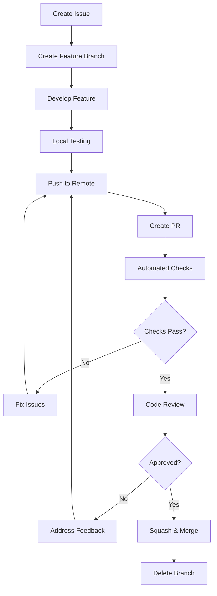
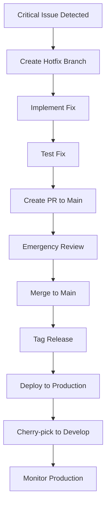
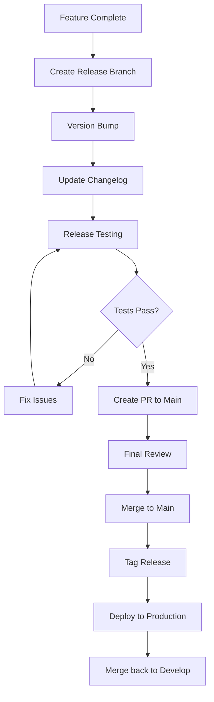

# Branch Strategy and Merge Requirements

## Overview

This document defines the branching strategy, merge requirements, and workflow policies for the Oatie project to ensure code quality, stability, and efficient collaboration.

## Branching Strategy

We use a **GitFlow-inspired** branching model with modifications for modern CI/CD practices.

### Branch Types

#### 1. Main Branches

##### `main`
- **Purpose**: Production-ready code
- **Protection**: Highly protected, merge via PR only
- **Deployment**: Automatically deployed to production
- **Quality Gates**: All checks must pass, multiple reviews required

##### `develop`
- **Purpose**: Integration branch for new features
- **Protection**: Protected, merge via PR only
- **Deployment**: Automatically deployed to staging environment
- **Quality Gates**: All checks must pass, one review required

#### 2. Supporting Branches

##### Feature Branches (`feature/*`)
- **Purpose**: New feature development
- **Naming**: `feature/issue-number-description` or `feature/short-description`
- **Base**: Created from `develop`
- **Merge**: Into `develop` via PR
- **Lifetime**: Deleted after merge

Examples:
```
feature/123-user-authentication
feature/report-generation-api
feature/oauth-integration
```

##### Bugfix Branches (`bugfix/*`)
- **Purpose**: Non-critical bug fixes
- **Naming**: `bugfix/issue-number-description`
- **Base**: Created from `develop`
- **Merge**: Into `develop` via PR
- **Lifetime**: Deleted after merge

##### Hotfix Branches (`hotfix/*`)
- **Purpose**: Critical production bug fixes
- **Naming**: `hotfix/issue-number-description`
- **Base**: Created from `main`
- **Merge**: Into both `main` and `develop` via PR
- **Lifetime**: Deleted after merge

##### Release Branches (`release/*`)
- **Purpose**: Prepare new production release
- **Naming**: `release/vX.Y.Z`
- **Base**: Created from `develop`
- **Merge**: Into `main` and `develop` via PR
- **Lifetime**: Deleted after merge

## Branch Protection Rules

### Main Branch Protection

```yaml
Protection Rules for 'main':
  required_status_checks:
    strict: true
    contexts:
      - "continuous-integration"
      - "code-quality"
      - "security-scan"
      - "performance-tests"
  
  required_pull_request_reviews:
    required_approving_review_count: 2
    dismiss_stale_reviews: true
    require_code_owner_reviews: true
    require_last_push_approval: true
  
  restrictions:
    users: []
    teams: ["senior-developers", "tech-leads"]
  
  enforce_admins: true
  allow_force_pushes: false
  allow_deletions: false
```

### Develop Branch Protection

```yaml
Protection Rules for 'develop':
  required_status_checks:
    strict: true
    contexts:
      - "continuous-integration"
      - "code-quality"
      - "security-scan"
  
  required_pull_request_reviews:
    required_approving_review_count: 1
    dismiss_stale_reviews: true
    require_code_owner_reviews: false
  
  enforce_admins: true
  allow_force_pushes: false
  allow_deletions: false
```

## Merge Requirements

### Universal Requirements

All merges must satisfy:
- [ ] All required status checks pass
- [ ] No merge conflicts
- [ ] Branch is up to date with target branch
- [ ] Required number of approving reviews
- [ ] All conversations resolved

### Feature Branch Merges

#### Prerequisites
- [ ] Feature is complete and tested
- [ ] Documentation updated
- [ ] Tests added/updated with ≥95% coverage
- [ ] Code review completed
- [ ] No breaking changes (or properly documented)

#### Merge Process
1. **Update branch**: Rebase with latest `develop`
2. **Final checks**: Run full test suite locally
3. **Create PR**: Use provided template
4. **Review**: Address all feedback
5. **Merge**: Squash and merge into `develop`

```bash
# Example merge process
git checkout develop
git pull origin develop
git checkout feature/my-feature
git rebase develop
git push origin feature/my-feature --force-with-lease

# Create PR through GitHub UI
# After approval:
# Squash and merge via GitHub UI
```

### Hotfix Merges

#### Prerequisites
- [ ] Critical production issue identified
- [ ] Hotfix tested and verified
- [ ] Minimal changes only
- [ ] Emergency approval obtained
- [ ] Rollback plan prepared

#### Merge Process
1. **Create hotfix branch** from `main`
2. **Implement fix** with minimal changes
3. **Test thoroughly** in production-like environment
4. **Create PR** to `main` with expedited review
5. **Merge to main** and tag release
6. **Cherry-pick** or merge into `develop`

```bash
# Hotfix process
git checkout main
git pull origin main
git checkout -b hotfix/critical-security-fix

# Make minimal fix
git add .
git commit -m "fix: resolve critical security vulnerability"
git push origin hotfix/critical-security-fix

# Create PR to main
# After approval and merge:
git checkout develop
git cherry-pick <hotfix-commit-sha>
git push origin develop
```

### Release Merges

#### Prerequisites
- [ ] All features for release complete
- [ ] Release candidate tested
- [ ] Version numbers updated
- [ ] Changelog updated
- [ ] Release notes prepared
- [ ] Deployment plan ready

#### Merge Process
1. **Create release branch** from `develop`
2. **Finalize release** (version bumps, changelog)
3. **Test release candidate** thoroughly
4. **Create PR** to `main`
5. **Tag release** after merge
6. **Merge back** to `develop`

## Merge Methods

### Squash and Merge (Default)

**Use for**: Feature branches, bugfix branches
**Benefits**: Clean commit history, single commit per feature
**Process**: GitHub squashes all commits into one

```
Before: feat: add user auth (5 commits)
After:  feat: add user authentication system
```

### Merge Commit

**Use for**: Release branches, large features with meaningful commit history
**Benefits**: Preserves individual commits and their context
**Process**: Creates a merge commit

```
*   Merge pull request #123 from feature/user-auth
|\  
| * feat: add password validation
| * feat: add login endpoint
| * feat: add user model
|/  
*   Previous commit
```

### Rebase and Merge

**Use for**: Small hotfixes, single commits
**Benefits**: Linear history without merge commits
**Process**: Replays commits on top of target branch

```
Before: main -> A -> B
        feature -> C
After:  main -> A -> B -> C
```

## Quality Gates

### Automated Checks

All branches must pass:

#### Code Quality
- **Linting**: ESLint (TypeScript), Pylint (Python)
- **Formatting**: Prettier, Black
- **Type Checking**: TypeScript compiler, MyPy
- **Complexity**: Cyclomatic complexity analysis

#### Testing
- **Unit Tests**: >95% coverage required
- **Integration Tests**: All API endpoints tested
- **E2E Tests**: Critical user journeys tested
- **Performance Tests**: No regression in key metrics

#### Security
- **Dependency Scanning**: Snyk, npm audit
- **Code Analysis**: CodeQL, Bandit
- **Secret Detection**: detect-secrets
- **License Compliance**: License compatibility check

#### Documentation
- **API Documentation**: OpenAPI specs up to date
- **Code Documentation**: JSDoc/Sphinx coverage
- **README**: Updated with new features
- **Changelog**: Changes documented

### Manual Reviews

#### Code Review Checklist
- [ ] Code follows project standards
- [ ] Logic is sound and efficient
- [ ] Error handling is appropriate
- [ ] Security implications considered
- [ ] Performance impact acceptable
- [ ] Tests are comprehensive
- [ ] Documentation is updated

#### Architecture Review
Required for:
- New services or major components
- Database schema changes
- External API integrations
- Performance-critical changes
- Security-sensitive modifications

#### Security Review
Required for:
- Authentication/authorization changes
- Data handling modifications
- External integrations
- Infrastructure changes
- Dependency updates with security implications

## Workflow Examples

### Standard Feature Development



### Hotfix Workflow



### Release Workflow



## Best Practices

### Branch Naming

#### Good Examples
```
feature/123-implement-oauth2-authentication
feature/add-report-generation-api
bugfix/456-fix-memory-leak-in-parser
hotfix/789-resolve-sql-injection-vulnerability
release/v2.1.0
```

#### Avoid
```
feature/fix-stuff
bugfix/bug
hotfix/urgent
my-feature
temp-branch
```

### Commit Messages

Follow [Conventional Commits](https://www.conventionalcommits.org/):

```
type(scope): description

[optional body]

[optional footer]
```

#### Examples
```
feat(auth): implement OAuth2 authentication flow
fix(api): resolve memory leak in report generation
docs(readme): update installation instructions
chore(deps): bump lodash from 4.17.20 to 4.17.21
```

### Pull Request Best Practices

#### Before Creating PR
- [ ] Rebase with target branch
- [ ] Run full test suite locally
- [ ] Self-review all changes
- [ ] Update documentation
- [ ] Add meaningful description

#### PR Description Template
```markdown
## What
Brief description of changes

## Why
Why these changes are needed

## How
How the changes were implemented

## Testing
How the changes were tested

## Breaking Changes
Any breaking changes and migration path

## Screenshots
UI changes (if applicable)
```

### Branch Hygiene

#### Regular Maintenance
- Delete merged branches promptly
- Keep branch count manageable (<20 active)
- Regular cleanup of stale branches
- Monitor branch age and complexity

#### Branch Lifecycle
```bash
# Create and switch to new branch
git checkout -b feature/new-feature

# Regular sync with develop
git fetch origin
git rebase origin/develop

# Push with force-with-lease for safety
git push origin feature/new-feature --force-with-lease

# After merge, delete local and remote
git checkout develop
git branch -d feature/new-feature
git push origin --delete feature/new-feature
```

## Troubleshooting

### Common Issues

#### Merge Conflicts
```bash
# During rebase
git rebase origin/develop
# Resolve conflicts in files
git add .
git rebase --continue

# During merge
git merge develop
# Resolve conflicts in files
git add .
git commit
```

#### Failed Checks
```bash
# Re-run checks locally
npm run lint:fix
npm run test
npm run build

# Fix issues and push
git add .
git commit -m "fix: resolve linting issues"
git push origin feature/branch-name
```

#### Force Push Safety
```bash
# Safe force push
git push origin feature/branch-name --force-with-lease

# Check what would be overwritten
git push origin feature/branch-name --force-with-lease --dry-run
```

This branching strategy ensures code quality, facilitates collaboration, and maintains a stable production environment while enabling rapid development and deployment.