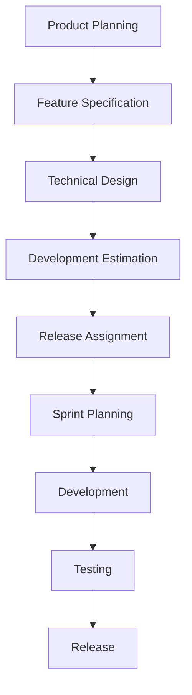
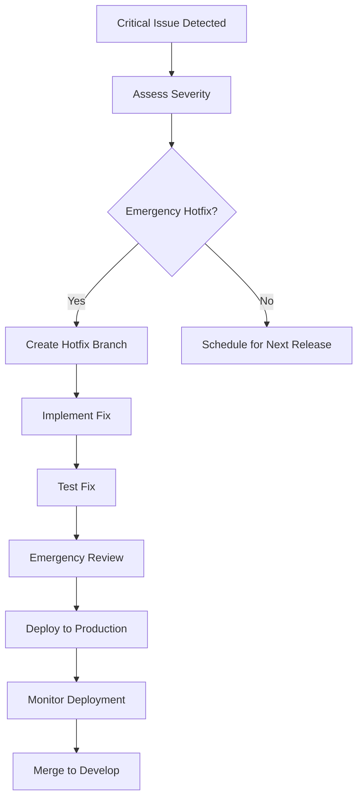

# Release Process and Versioning Strategy

## Overview

This document outlines the release process, versioning strategy, and deployment procedures for the Oatie AI reporting platform.

## Versioning Strategy

### Semantic Versioning

We follow [Semantic Versioning (SemVer) 2.0.0](https://semver.org/) with the format `MAJOR.MINOR.PATCH`:

- **MAJOR**: Incompatible API changes
- **MINOR**: Backward-compatible functionality additions
- **PATCH**: Backward-compatible bug fixes

#### Examples
- `1.0.0` → `1.0.1`: Bug fix release
- `1.0.1` → `1.1.0`: New feature release
- `1.1.0` → `2.0.0`: Breaking change release

### Pre-release Versions

For pre-release versions, we use:
- **Alpha**: `1.1.0-alpha.1` (internal testing)
- **Beta**: `1.1.0-beta.1` (external testing)
- **Release Candidate**: `1.1.0-rc.1` (final testing)

### Version Components

```
1.2.3-beta.1+20231201.abcd123
│ │ │   │     │    │       │
│ │ │   │     │    │       └─ Build metadata (commit hash)
│ │ │   │     │    └─ Build metadata (date)
│ │ │   │     └─ Pre-release version
│ │ │   └─ Pre-release type
│ │ └─ Patch version
│ └─ Minor version
└─ Major version
```

## Release Types

### 1. Regular Releases

#### Minor Releases (Feature Releases)
- **Frequency**: Every 2-4 weeks
- **Content**: New features, enhancements, non-critical bug fixes
- **Process**: Full release process with testing
- **Example**: `1.1.0` → `1.2.0`

#### Patch Releases (Bug Fix Releases)
- **Frequency**: As needed, typically weekly
- **Content**: Bug fixes, small improvements
- **Process**: Abbreviated testing, faster deployment
- **Example**: `1.1.0` → `1.1.1`

#### Major Releases (Breaking Changes)
- **Frequency**: Every 6-12 months
- **Content**: Breaking changes, major architecture updates
- **Process**: Extended testing, migration guides
- **Example**: `1.9.0` → `2.0.0`

### 2. Emergency Releases

#### Hotfixes
- **Frequency**: As needed for critical issues
- **Content**: Critical bug fixes, security patches
- **Process**: Fast-tracked with minimal testing
- **Example**: `1.1.0` → `1.1.1`

## Release Planning

### Release Calendar

```yaml
Release Schedule:
  Major Releases:
    - Q2 2024: v2.0.0 (Oracle Redwood UI redesign)
    - Q4 2024: v3.0.0 (Advanced AI features)
  
  Minor Releases:
    - Monthly feature releases
    - Sprint-based development cycle
  
  Patch Releases:
    - As needed for bug fixes
    - Weekly maintenance window
  
  Hotfixes:
    - Emergency releases for critical issues
    - 24/7 availability for security issues
```

### Feature Planning

#### Feature Categories
1. **Core Features**: Report generation, data analysis
2. **AI Features**: Natural language processing, automated insights
3. **Integration Features**: Oracle BI Publisher, external APIs
4. **UI/UX Features**: Redwood design system, accessibility
5. **Platform Features**: Performance, security, scalability

#### Release Planning Process


## Release Process

### 1. Pre-Release Phase

#### Feature Freeze
- **Timeline**: 1 week before release
- **Activities**: No new features, bug fixes only
- **Goal**: Stabilize release candidate

#### Release Candidate Creation
```bash
# Create release branch
git checkout develop
git pull origin develop
git checkout -b release/v1.2.0

# Update version numbers
npm version minor --no-git-tag-version
# Update Python version in __init__.py
# Update version in documentation

# Commit version changes
git add .
git commit -m "chore: bump version to 1.2.0"
git push origin release/v1.2.0
```

#### Testing Phase
1. **Automated Testing**
   - Unit tests (>95% coverage)
   - Integration tests
   - E2E tests
   - Performance tests
   - Security scans

2. **Manual Testing**
   - User acceptance testing
   - Regression testing
   - Cross-browser testing
   - Mobile testing
   - Accessibility testing

3. **Staging Deployment**
   - Deploy to staging environment
   - Smoke tests
   - Performance monitoring
   - User acceptance by stakeholders

### 2. Release Execution

#### Release Checklist
```markdown
## Pre-Release
- [ ] Release branch created
- [ ] Version numbers updated
- [ ] Changelog updated
- [ ] Documentation updated
- [ ] All tests passing
- [ ] Security scan completed
- [ ] Performance benchmarks met
- [ ] Staging deployment successful
- [ ] User acceptance testing completed

## Release
- [ ] Final merge to main
- [ ] Git tag created
- [ ] Release notes published
- [ ] Production deployment initiated
- [ ] Deployment monitoring active
- [ ] Rollback plan ready

## Post-Release
- [ ] Production smoke tests passed
- [ ] Monitoring dashboards green
- [ ] User notifications sent
- [ ] Documentation published
- [ ] Release announcement made
- [ ] Hotfix branch created (if needed)
```

#### Git Tagging
```bash
# Create and push release tag
git checkout main
git pull origin main
git tag -a v1.2.0 -m "Release version 1.2.0"
git push origin v1.2.0

# Create release on GitHub
gh release create v1.2.0 \
  --title "Release v1.2.0" \
  --notes-file RELEASE_NOTES.md \
  --draft
```

### 3. Deployment Process

#### Production Deployment
```yaml
Deployment Pipeline:
  1. Build Phase:
     - Compile TypeScript
     - Bundle frontend assets
     - Build Docker images
     - Run security scans
  
  2. Pre-deployment:
     - Database migrations (if needed)
     - Configuration updates
     - Health check endpoints
  
  3. Deployment:
     - Blue-green deployment
     - Rolling updates
     - Health monitoring
  
  4. Post-deployment:
     - Smoke tests
     - Performance validation
     - Monitoring alerts
```

#### Deployment Script Example
```bash
#!/bin/bash
# Production deployment script

set -e

VERSION=$1
if [ -z "$VERSION" ]; then
  echo "Usage: ./deploy.sh <version>"
  exit 1
fi

echo "Deploying version $VERSION to production..."

# Build and test
npm run build:prod
npm run test:prod

# Docker build
docker build -t oatie:$VERSION .
docker tag oatie:$VERSION oatie:latest

# Database migrations
npm run migrate:prod

# Deploy with rolling update
kubectl set image deployment/oatie-api api=oatie:$VERSION
kubectl rollout status deployment/oatie-api

# Health checks
./scripts/health-check.sh

echo "Deployment of version $VERSION completed successfully!"
```

### 4. Post-Release

#### Monitoring and Validation
- **Health Checks**: Endpoint availability and response times
- **Error Monitoring**: Application errors and exceptions
- **Performance Metrics**: Response times, throughput, resource usage
- **User Metrics**: Active users, feature adoption, error rates

#### Release Communication
```markdown
## Release Announcement Template

### Oatie v1.2.0 Released 🎉

We're excited to announce the release of Oatie v1.2.0, featuring enhanced AI capabilities and improved Oracle BI Publisher integration.

#### 🚀 New Features
- Advanced natural language query processing
- Real-time report collaboration
- Enhanced dashboard customization
- Mobile-responsive design improvements

#### 🐛 Bug Fixes
- Fixed memory leak in report generation
- Resolved authentication timeout issues
- Improved error handling for large datasets

#### 🔧 Improvements
- 40% faster report generation
- Reduced memory usage by 25%
- Enhanced accessibility compliance
- Updated Oracle Redwood components

#### 📖 Documentation
- Updated API documentation
- New tutorial videos
- Enhanced troubleshooting guide

#### 🚨 Breaking Changes
None in this release.

#### 📥 Upgrade Instructions
For automatic updates, no action required.
For manual installations: [Upgrade Guide](docs/upgrade.md)

#### 🐞 Known Issues
- Report export timeout for datasets >100k rows (fix planned for v1.2.1)

---
Full changelog: [CHANGELOG.md](CHANGELOG.md)
```

## Hotfix Process

### Emergency Hotfix Procedure

#### Trigger Conditions
- **Security vulnerabilities** (immediate)
- **Data corruption** or loss (immediate)
- **Service unavailability** (immediate)
- **Critical functionality broken** (4-hour window)

#### Hotfix Workflow


#### Hotfix Implementation
```bash
# Create hotfix branch from main
git checkout main
git pull origin main
git checkout -b hotfix/critical-security-fix

# Implement minimal fix
# Update version (patch increment)
npm version patch --no-git-tag-version

# Commit and push
git add .
git commit -m "fix: resolve critical security vulnerability"
git push origin hotfix/critical-security-fix

# Create emergency PR
gh pr create \
  --title "HOTFIX: Critical security vulnerability" \
  --body "Emergency fix for CVE-2023-XXXX" \
  --base main \
  --head hotfix/critical-security-fix \
  --reviewer @team-leads
```

## Release Automation

### Automated Release Pipeline

#### GitHub Actions Workflow
```yaml
name: Release

on:
  push:
    tags:
      - 'v*'

jobs:
  release:
    runs-on: ubuntu-latest
    steps:
      - uses: actions/checkout@v4
      
      - name: Setup Node.js
        uses: actions/setup-node@v4
        with:
          node-version: '18'
          cache: 'npm'
      
      - name: Install dependencies
        run: npm ci
      
      - name: Run tests
        run: npm run test:prod
      
      - name: Build application
        run: npm run build:prod
      
      - name: Build Docker image
        run: |
          docker build -t oatie:${{ github.ref_name }} .
          docker tag oatie:${{ github.ref_name }} oatie:latest
      
      - name: Deploy to production
        run: ./scripts/deploy.sh ${{ github.ref_name }}
        env:
          KUBECONFIG: ${{ secrets.KUBECONFIG }}
      
      - name: Create GitHub release
        uses: actions/create-release@v1
        env:
          GITHUB_TOKEN: ${{ secrets.GITHUB_TOKEN }}
        with:
          tag_name: ${{ github.ref }}
          release_name: Release ${{ github.ref }}
          body_path: RELEASE_NOTES.md
          draft: false
          prerelease: false
```

### Automated Version Bumping

#### Package.json Integration
```json
{
  "scripts": {
    "version:patch": "npm version patch && git push && git push --tags",
    "version:minor": "npm version minor && git push && git push --tags",
    "version:major": "npm version major && git push && git push --tags",
    "release": "npm run version:minor"
  }
}
```

#### Conventional Commits Integration
```bash
# Install commitizen for standardized commits
npm install -g commitizen cz-conventional-changelog

# Configure commitizen
echo '{ "path": "cz-conventional-changelog" }' > ~/.czrc

# Use for commits
git cz
```

## Rollback Procedures

### Rollback Decision Matrix

| Issue Severity | Rollback Timeline | Approval Required |
|----------------|------------------|-------------------|
| Critical (P0) | Immediate | On-call engineer |
| High (P1) | Within 1 hour | Team lead |
| Medium (P2) | Within 4 hours | Product owner |
| Low (P3) | Next release | Standard process |

### Rollback Process

#### Automated Rollback
```bash
# Kubernetes rollback
kubectl rollout undo deployment/oatie-api

# Verify rollback
kubectl rollout status deployment/oatie-api

# Database rollback (if needed)
npm run migrate:rollback
```

#### Manual Rollback
```bash
# Revert to previous Git tag
git checkout main
git reset --hard v1.1.9
git tag -f v1.1.10
git push origin main --force-with-lease
git push origin v1.1.10 --force
```

## Metrics and Monitoring

### Release Metrics

#### Key Performance Indicators
- **Release Frequency**: Releases per month
- **Lead Time**: Feature to production time
- **Deployment Time**: Time to deploy
- **Rollback Rate**: Percentage of releases rolled back
- **Mean Time to Recovery**: Time to fix issues

#### Quality Metrics
- **Bug Escape Rate**: Bugs found in production
- **Test Coverage**: Code coverage percentage
- **Security Vulnerabilities**: Issues found post-release
- **Performance Regression**: Performance degradation

### Monitoring Dashboard

#### Release Health Dashboard
```yaml
Metrics:
  - Deployment Success Rate
  - Application Error Rate
  - Response Time P95
  - Active User Count
  - Feature Adoption Rate
  - System Resource Usage

Alerts:
  - Error rate > 1%
  - Response time > 2s
  - CPU usage > 80%
  - Memory usage > 85%
  - Disk space < 10%
```

This comprehensive release process ensures reliable, high-quality deployments while maintaining the ability to respond quickly to critical issues.