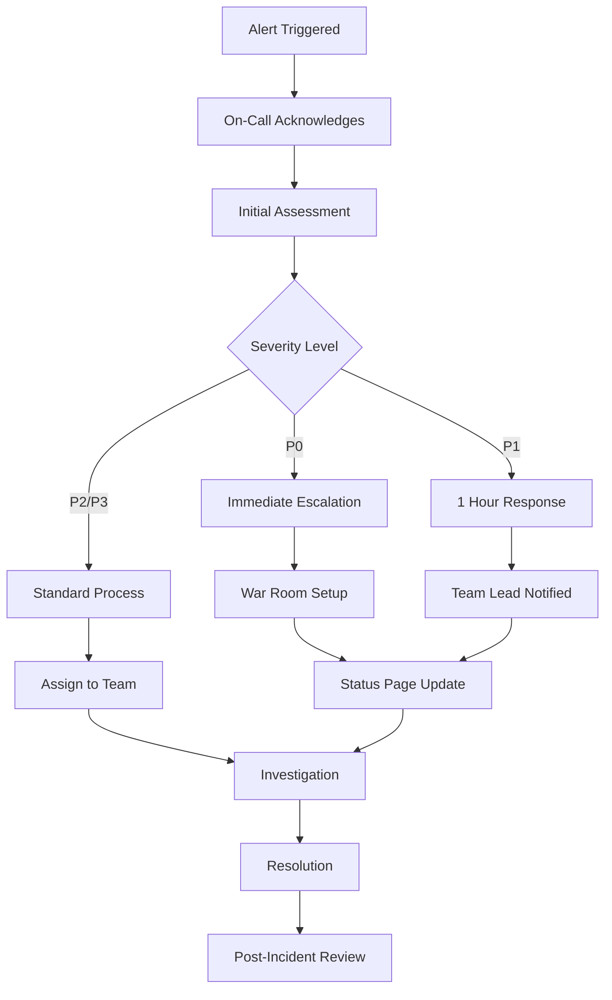

# Troubleshooting Guide

## Overview

This guide provides solutions to common issues, debugging procedures, and escalation paths for the Oatie AI reporting platform.

## Common Issues and Solutions

### 1. Authentication and Authorization Issues

#### Issue: "Invalid JWT Token" Error
**Symptoms:**
- 401 Unauthorized responses
- "Token expired" or "Invalid token" messages
- Users unable to access protected endpoints

**Diagnosis:**
```bash
# Check token expiration
echo "your-jwt-token" | cut -d. -f2 | base64 -d | jq .exp

# Verify token structure
echo "your-jwt-token" | cut -d. -f2 | base64 -d | jq .
```

**Solutions:**
1. **Token Expired:**
   ```bash
   # Refresh token using refresh endpoint
   curl -X POST /auth/refresh \
     -H "Content-Type: application/json" \
     -d '{"refreshToken": "your-refresh-token"}'
   ```

2. **Invalid Token Format:**
   - Ensure token includes "Bearer " prefix
   - Check for truncated tokens in logs
   - Verify token encoding/decoding

3. **Clock Skew Issues:**
   ```bash
   # Check server time synchronization
   ntpdate -q pool.ntp.org
   
   # Adjust JWT validation tolerance
   export JWT_CLOCK_TOLERANCE=300  # 5 minutes
   ```

**Prevention:**
- Implement automatic token refresh
- Add proper error handling for expired tokens
- Monitor token expiration patterns

#### Issue: "Insufficient Permissions" Error
**Symptoms:**
- 403 Forbidden responses
- Users cannot access features they should have access to
- Role-based access control not working

**Diagnosis:**
```sql
-- Check user permissions
SELECT u.email, u.role, o.name as organization
FROM users u
JOIN organizations o ON u.organization_id = o.id
WHERE u.email = 'user@example.com';

-- Check specific permissions
SELECT * FROM user_permissions 
WHERE user_id = 'user-uuid' 
AND permission = 'reports:create';
```

**Solutions:**
1. **Role Assignment:**
   ```sql
   -- Update user role
   UPDATE users 
   SET role = 'report_manager' 
   WHERE email = 'user@example.com';
   ```

2. **Permission Cache Refresh:**
   ```bash
   # Clear Redis permission cache
   redis-cli DEL "permissions:user-uuid"
   
   # Restart authentication service
   kubectl rollout restart deployment/auth-service
   ```

### 2. Report Generation Issues

#### Issue: Reports Failing to Generate
**Symptoms:**
- Reports stuck in "processing" status
- Error messages in report execution logs
- Oracle BI Publisher connection failures

**Diagnosis:**
```bash
# Check report status
curl -X GET /api/v1/reports/{report-id}/executions \
  -H "Authorization: Bearer $TOKEN"

# Check Oracle BI Publisher connectivity
curl -X GET /api/v1/health/oracle-bi \
  -H "Authorization: Bearer $TOKEN"

# Review application logs
kubectl logs -f deployment/report-service --tail=100
```

**Solutions:**
1. **Oracle BI Publisher Connection:**
   ```bash
   # Test connection manually
   sqlplus username/password@oracle-host:1521/service_name
   
   # Check network connectivity
   telnet oracle-bi-host 9502
   
   # Verify credentials
   curl -X POST https://oracle-bi-host/xmlpserver/services/PublicReportService \
     -u "username:password" \
     -d '<soap:request>...</soap:request>'
   ```

2. **Memory Issues:**
   ```bash
   # Check memory usage
   kubectl top pods -l app=report-service
   
   # Increase memory limits
   kubectl patch deployment report-service -p '{"spec":{"template":{"spec":{"containers":[{"name":"report-service","resources":{"limits":{"memory":"2Gi"}}}]}}}}'
   ```

3. **Database Connection Pool:**
   ```sql
   -- Check active connections
   SELECT count(*) FROM pg_stat_activity 
   WHERE state = 'active';
   
   -- Check connection pool status
   SELECT * FROM pg_stat_database 
   WHERE datname = 'oatie';
   ```

#### Issue: Report Performance Issues
**Symptoms:**
- Reports taking too long to generate
- Timeouts during report execution
- High resource usage

**Diagnosis:**
```sql
-- Identify slow queries
SELECT query, mean_exec_time, calls
FROM pg_stat_statements
WHERE mean_exec_time > 1000
ORDER BY mean_exec_time DESC;

-- Check query execution plans
EXPLAIN ANALYZE SELECT * FROM reports 
WHERE organization_id = 'uuid' 
AND status = 'processing';
```

**Solutions:**
1. **Database Optimization:**
   ```sql
   -- Add missing indexes
   CREATE INDEX idx_reports_org_status 
   ON reports(organization_id, status);
   
   -- Update statistics
   ANALYZE reports;
   
   -- Vacuum tables
   VACUUM ANALYZE report_executions;
   ```

2. **Query Optimization:**
   ```sql
   -- Optimize with proper indexes
   SELECT r.*, t.name as template_name
   FROM reports r
   JOIN templates t ON r.template_id = t.id
   WHERE r.organization_id = $1
     AND r.status = $2
   ORDER BY r.created_at DESC
   LIMIT 20;
   ```

3. **Caching Implementation:**
   ```python
   # Add Redis caching for frequently accessed data
   @cache.memoize(timeout=300)  # 5 minutes
   def get_report_template(template_id):
       return Template.query.get(template_id)
   ```

### 3. Database Issues

#### Issue: Connection Pool Exhaustion
**Symptoms:**
- "Too many connections" errors
- Application unable to connect to database
- Intermittent database errors

**Diagnosis:**
```sql
-- Check current connections
SELECT count(*), state
FROM pg_stat_activity
GROUP BY state;

-- Check connection limits
SHOW max_connections;

-- Identify long-running connections
SELECT pid, now() - pg_stat_activity.query_start AS duration, query
FROM pg_stat_activity
WHERE (now() - pg_stat_activity.query_start) > interval '5 minutes';
```

**Solutions:**
1. **Increase Connection Pool:**
   ```python
   # In application configuration
   DATABASE_POOL_SIZE = 20
   DATABASE_POOL_OVERFLOW = 30
   DATABASE_POOL_TIMEOUT = 30
   ```

2. **Kill Long-Running Queries:**
   ```sql
   -- Kill specific connection
   SELECT pg_terminate_backend(pid)
   FROM pg_stat_activity
   WHERE pid = 12345;
   
   -- Kill all long-running queries
   SELECT pg_terminate_backend(pid)
   FROM pg_stat_activity
   WHERE (now() - pg_stat_activity.query_start) > interval '10 minutes';
   ```

3. **Connection Pool Monitoring:**
   ```python
   # Add connection pool monitoring
   from sqlalchemy import event
   
   @event.listens_for(engine, "connect")
   def set_sqlite_pragma(dbapi_connection, connection_record):
       logger.info(f"New database connection established")
   
   @event.listens_for(engine, "close")
   def close_connection(dbapi_connection, connection_record):
       logger.info(f"Database connection closed")
   ```

#### Issue: Database Performance Degradation
**Symptoms:**
- Slow query execution
- High CPU usage on database server
- Application timeouts

**Diagnosis:**
```sql
-- Check slow queries
SELECT query, calls, total_exec_time, mean_exec_time
FROM pg_stat_statements
ORDER BY mean_exec_time DESC
LIMIT 10;

-- Check index usage
SELECT schemaname, tablename, indexname, idx_scan, idx_tup_read
FROM pg_stat_user_indexes
ORDER BY idx_scan ASC;

-- Check table bloat
SELECT schemaname, tablename, n_tup_ins, n_tup_upd, n_tup_del
FROM pg_stat_user_tables
ORDER BY n_tup_del DESC;
```

**Solutions:**
1. **Index Optimization:**
   ```sql
   -- Create missing indexes
   CREATE INDEX CONCURRENTLY idx_audit_logs_timestamp 
   ON audit_logs(timestamp DESC);
   
   -- Drop unused indexes
   DROP INDEX IF EXISTS idx_unused_index;
   ```

2. **Database Maintenance:**
   ```bash
   # Schedule regular maintenance
   #!/bin/bash
   # maintenance.sh
   
   # Vacuum and analyze
   psql $DATABASE_URL -c "VACUUM ANALYZE;"
   
   # Reindex
   psql $DATABASE_URL -c "REINDEX DATABASE oatie;"
   
   # Update statistics
   psql $DATABASE_URL -c "ANALYZE;"
   ```

### 4. Infrastructure Issues

#### Issue: High Memory Usage
**Symptoms:**
- Out of memory errors
- Pod restarts due to memory limits
- Application slowness

**Diagnosis:**
```bash
# Check memory usage
kubectl top nodes
kubectl top pods --all-namespaces

# Check memory limits
kubectl describe pod report-service-xxx

# Check application memory usage
curl http://localhost:8000/metrics | grep memory
```

**Solutions:**
1. **Increase Memory Limits:**
   ```yaml
   # kubernetes/deployment.yaml
   resources:
     requests:
       memory: "512Mi"
       cpu: "250m"
     limits:
       memory: "2Gi"
       cpu: "1"
   ```

2. **Memory Leak Detection:**
   ```python
   # Add memory profiling
   import tracemalloc
   
   tracemalloc.start()
   
   # Your application code
   
   current, peak = tracemalloc.get_traced_memory()
   print(f"Current memory usage: {current / 1024 / 1024:.1f} MB")
   print(f"Peak memory usage: {peak / 1024 / 1024:.1f} MB")
   tracemalloc.stop()
   ```

3. **Garbage Collection Tuning:**
   ```python
   # For Python applications
   import gc
   
   # Force garbage collection
   gc.collect()
   
   # Tune garbage collection thresholds
   gc.set_threshold(700, 10, 10)
   ```

#### Issue: Network Connectivity Problems
**Symptoms:**
- Service discovery failures
- Intermittent connection errors
- DNS resolution issues

**Diagnosis:**
```bash
# Test service connectivity
kubectl exec -it pod-name -- nslookup postgres-service

# Check network policies
kubectl get networkpolicies

# Test external connectivity
kubectl exec -it pod-name -- curl -I https://api.openai.com

# Check DNS configuration
kubectl exec -it pod-name -- cat /etc/resolv.conf
```

**Solutions:**
1. **DNS Issues:**
   ```bash
   # Restart CoreDNS
   kubectl rollout restart deployment/coredns -n kube-system
   
   # Check DNS configuration
   kubectl get configmap coredns -n kube-system -o yaml
   ```

2. **Network Policy:**
   ```yaml
   # Allow traffic between services
   apiVersion: networking.k8s.io/v1
   kind: NetworkPolicy
   metadata:
     name: allow-oatie-services
   spec:
     podSelector:
       matchLabels:
         app: oatie
     ingress:
     - from:
       - podSelector:
           matchLabels:
             app: oatie
   ```

## Debugging Procedures

### 1. Log Analysis

#### Centralized Logging Query Examples
```bash
# Search for errors in last hour
kubectl logs --since=1h -l app=oatie | grep ERROR

# Search for specific user issues
kubectl logs -l app=auth-service | grep "user@example.com"

# Search for database connection errors
kubectl logs -l app=report-service | grep "connection"

# Get logs from specific time range
kubectl logs --since-time=2024-01-15T10:00:00Z --until-time=2024-01-15T11:00:00Z deployment/report-service
```

#### Log Aggregation with ELK Stack
```json
// Elasticsearch query for error analysis
{
  "query": {
    "bool": {
      "must": [
        {"match": {"level": "ERROR"}},
        {"range": {"@timestamp": {"gte": "now-1h"}}}
      ]
    }
  },
  "aggs": {
    "error_types": {
      "terms": {"field": "error_type.keyword"}
    }
  }
}
```

### 2. Performance Monitoring

#### Application Metrics
```python
# Custom metrics for monitoring
from prometheus_client import Counter, Histogram, Gauge

# Request counters
request_count = Counter('requests_total', 'Total requests', ['method', 'endpoint'])
request_duration = Histogram('request_duration_seconds', 'Request duration')
active_users = Gauge('active_users', 'Currently active users')

# Database metrics
db_connection_pool = Gauge('db_connections_active', 'Active database connections')
query_duration = Histogram('db_query_duration_seconds', 'Database query duration')
```

#### Health Check Implementation
```python
# Health check endpoint
@app.get("/health")
async def health_check():
    checks = {
        "database": check_database_connection(),
        "redis": check_redis_connection(),
        "oracle_bi": check_oracle_bi_connection(),
        "disk_space": check_disk_space(),
        "memory": check_memory_usage(),
    }
    
    overall_status = "healthy" if all(checks.values()) else "unhealthy"
    
    return {
        "status": overall_status,
        "timestamp": datetime.utcnow().isoformat(),
        "checks": checks
    }
```

### 3. Database Debugging

#### Query Performance Analysis
```sql
-- Enable query logging
ALTER SYSTEM SET log_statement = 'all';
ALTER SYSTEM SET log_min_duration_statement = 1000; -- Log queries > 1s

-- Create monitoring views
CREATE VIEW slow_queries AS
SELECT query, calls, total_exec_time, mean_exec_time,
       rows, 100.0 * shared_blks_hit /
       nullif(shared_blks_hit + shared_blks_read, 0) AS hit_percent
FROM pg_stat_statements
ORDER BY mean_exec_time DESC;

-- Monitor blocking queries
SELECT blocked_locks.pid AS blocked_pid,
       blocked_activity.usename AS blocked_user,
       blocking_locks.pid AS blocking_pid,
       blocking_activity.usename AS blocking_user,
       blocked_activity.query AS blocked_statement,
       blocking_activity.query AS current_statement_in_blocking_process
FROM pg_catalog.pg_locks blocked_locks
JOIN pg_catalog.pg_stat_activity blocked_activity ON blocked_activity.pid = blocked_locks.pid
JOIN pg_catalog.pg_locks blocking_locks ON blocking_locks.locktype = blocked_locks.locktype
JOIN pg_catalog.pg_stat_activity blocking_activity ON blocking_activity.pid = blocking_locks.pid
WHERE NOT blocked_locks.granted;
```

## Escalation Procedures

### 1. Severity Levels

#### P0 - Critical (Immediate Response)
- **Definition**: Complete service outage, data loss, security breach
- **Response Time**: 15 minutes
- **Escalation**: Immediately notify on-call engineer
- **Communication**: Status page update within 30 minutes

#### P1 - High (1 Hour Response)
- **Definition**: Major functionality broken, significant user impact
- **Response Time**: 1 hour
- **Escalation**: Notify team lead and on-call engineer
- **Communication**: Internal notification, consider status page

#### P2 - Medium (4 Hour Response)
- **Definition**: Moderate impact, workaround available
- **Response Time**: 4 hours
- **Escalation**: Assign to appropriate team member
- **Communication**: Internal tracking, user notification if needed

#### P3 - Low (Next Business Day)
- **Definition**: Minor issues, cosmetic problems
- **Response Time**: Next business day
- **Escalation**: Standard triage process
- **Communication**: Internal tracking only

### 2. On-Call Procedures

#### Incident Response Workflow


#### Contact Information
```yaml
Escalation Contacts:
  Primary On-Call:
    - Name: "Current On-Call Engineer"
    - Phone: "+1-555-0123"
    - Email: "oncall@oatie.ai"
    - Slack: "@oncall"
  
  Team Lead:
    - Name: "Engineering Lead"
    - Phone: "+1-555-0124"
    - Email: "lead@oatie.ai"
    - Slack: "@engineering-lead"
  
  Engineering Manager:
    - Name: "Engineering Manager"
    - Phone: "+1-555-0125"
    - Email: "manager@oatie.ai"
    - Slack: "@eng-manager"
```

### 3. Communication Templates

#### Incident Notification Template
```
🚨 INCIDENT ALERT 🚨

Severity: P1
Service: Report Generation
Impact: Users unable to generate new reports
Started: 2024-01-15 14:30 UTC

Current Status: INVESTIGATING
ETA for Resolution: TBD

Actions Taken:
- Identified database connection pool exhaustion
- Restarted report service
- Monitoring system recovery

Next Steps:
- Increase connection pool size
- Implement circuit breaker
- Monitor for stability

Incident Commander: @oncall-engineer
War Room: #incident-response

Updates will be provided every 30 minutes.
```

#### Resolution Notification Template
```
✅ INCIDENT RESOLVED ✅

Severity: P1
Service: Report Generation
Duration: 45 minutes (14:30 - 15:15 UTC)

Root Cause:
Database connection pool exhaustion due to increased load during peak hours.

Resolution:
- Increased connection pool size from 10 to 20
- Added connection pool monitoring
- Implemented connection timeout settings

Prevention:
- Added alerting for connection pool usage
- Scheduled capacity planning review
- Updated runbook with troubleshooting steps

Post-Incident Review:
Scheduled for 2024-01-16 10:00 UTC
Meeting link: [Teams Meeting]

Thank you for your patience.
```

This troubleshooting guide provides comprehensive solutions for common issues and clear escalation procedures to ensure rapid resolution of problems in the Oatie platform.